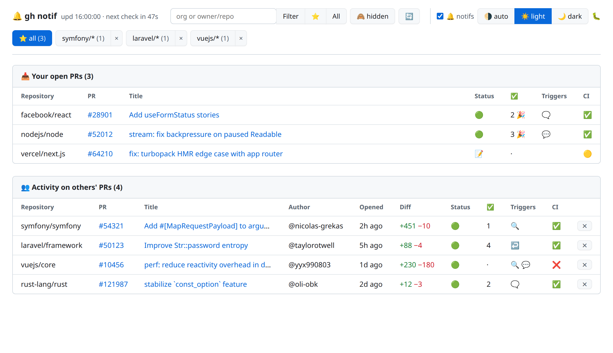

> # ⚠️ WARNING
> **This entire repository was vibe-coded.**

# gh-notif

A [`gh`](https://cli.github.com/) extension that gives you **finely filtered** GitHub notifications
in a **local, auto-refreshing web dashboard**, where the native GitHub inbox is too noisy.

Running `gh notif` starts a tiny local web server and opens a page presenting **two tables**:



*(Sample data with open-source repositories; the page picks up the GitHub colors and follows your light/dark theme.)*

## What it does

The dashboard shows **two tables**:

- **📥 Your open PRs** — all your open PRs (a dashboard), with their status, the number of reviews
  received, the CI status and any activity triggers.
- **👥 Activity on others' PRs** — others' PRs that concern you (requested reviews, mentions,
  replies to your threads), with author, opening date, diff size, status, number of reviews, CI.

Common columns: **Status** (📝 draft · 🟢 open · 🟣 merged · 🔴 closed) and **✅** (number of
**approvals** — distinct users whose last review approves, `·` if none).

On **your** open PRs, from **2 approvals** the ✅ column shows **`2 🎉`**: the PR is
**ready to merge**. Each new approval also pushes a **desktop notification** (`@bob approved your
PR`, suffixed with `🎉 ready to merge` beyond 2).

The **repository / PR / title are clickable** and open in a new tab.

### What triggers a row (the « triggers »)

| Icon | Trigger | When |
|-------|---------|-------|
| 🔍 | review | you were asked for a review (or it's still pending) |
| 💬 | mention | you were `@`-mentioned |
| ↩️ | reply | someone replied in a review thread you took part in |
| 🗨️ | comment | someone commented on **your** PR |

In the tables, only the emoji is shown (to save space); this legend gives its meaning (also on hover).
A single PR can accumulate several triggers.

### What is deliberately **ignored**

- PR updates: push, new commit, CI status, merge/close, label/assignee;
- third-party activity on a PR where you are a **mere reviewer** (unless someone replies to your
  thread or mentions you);
- **others' draft PRs** (your own drafts stay shown in « Your open PRs »);
- anything that is not a Pull Request (issues, releases, discussions).

### Favorites — follow several scopes without mixing them

You follow `symfony`, `noctud/collection` and `zenstruck`? Pin them:

```bash
gh notif fav add symfony
gh notif fav add noctud/collection
gh notif fav add zenstruck
```

Adding **verifies that the scope exists on GitHub** (org/user or repository): a typo is refused
with a clear message instead of pinning a dead favorite.

As soon as a favorite exists, `gh notif` no longer looks at all of GitHub but at **the union of
your favorites**, presented as **chips in the page header** — an org is shown as `symfony/*` (all its
repositories), a repository as-is. Each chip carries a counter `(n)` = the **activity on others'
PRs** in that scope (your own PRs and the hidden ones don't count) — including on the favorites you're
not looking at, to see at a glance where things are moving.

Click a chip to switch, the cross removes it, and the **⭐** button pins the content of the scope
field (the chip appears immediately, the tables follow as soon as the re-poll ends). The choice is
**persisted**: you find your view again at the next launch, or you force it with
`gh notif --fav symfony`. A manually entered scope takes back control from favorites (the chips go
greyed out) until you click a chip again.

The key point: **desktop notifications always cover *all* your favorites**, even those you're not
looking at. The active favorite only filters the display — that's why switching favorite is instant
and **costs no GitHub request**.

You can also list/manage favorites from the terminal:

```bash
gh notif fav list             # list favorites (⭐ = the one shown)
gh notif fav rm zenstruck     # remove a favorite
```

> Limit: a GitHub search is capped at 256 characters, so the list is too (about ten favorites with
> short names). Prefer an org over enumerating its repositories.

## The web page

`gh notif` launches a small **local HTTP server** and opens the page, which **refreshes on its own**
(without reloading):

```bash
gh notif                # http://localhost:7777, opens the browser
gh notif --port 8080    # on another port
gh notif --no-open      # do not open the browser (the URL stays printed)
gh notif --org symfony   # restricts the scope
```

A **single server-side poll loop** (~60 s) queries GitHub and feeds the page; several open tabs
therefore don't multiply the calls. The page refreshes on its own (~10 s) with a **countdown**;
links open in a **new tab**. Each new event pushes a **desktop notification** (`notify-send` on
Linux, `osascript` on macOS).

On the very first launch, the existing backlog is marked « seen » **without alerting**: the tables
are shown, but you're only notified (desktop) of events happening **after** startup.

From the page, you can:

- **🔄 refresh** immediately (without waiting for the next poll);
- **hide / restore** one of the others' PRs via the **✕** button on its row (persisted; reappears on
  a new trigger — reply to your thread, mention, comment), and **🙈 hidden** shows the hidden PRs
  (greyed out, restore button). Your own PRs are never hidden. The list is persisted in
  `~/.local/state/gh-notif/hidden-v1.json`.
- **filter by org/repo**: type `symfony` or `symfony/web` in the field then **Filter** (the server
  loads **only** that scope); **All** shows everything again.
- **turn off desktop notifications**: uncheck **🔔 notifs** in the header. The server keeps tracking
  events (they are marked « seen » silently), it simply stops pushing notifs — re-checking therefore
  does **not** trigger a burst of old notifs. The choice is **persisted** in
  `~/.local/state/gh-notif/prefs-v1.json` (survives a restart).
- **choose the theme**: the **🌗 auto / ☀️ light / 🌙 dark** switcher in the header. `auto` follows
  your system (default); `light`/`dark` force it. Applied immediately (without reloading) and
  **persisted** in the same preferences file.
- **sort « others' PRs »**: click a column header (date / approvals / author) to sort; click again
  to reverse. Persisted.

The **look & feel** picks up the GitHub colors (Primer, light/dark depending on your system). Zero
dependency: served by Node's native HTTP module, everything is inline (no external asset).
`Ctrl-C` stops the server. A **🐛** link in the header leads to the debug page (see below).

### Request cost (long loops)

The server runs for a long time: to spare the GitHub **rate-limit**, a poll only re-inspects the
notification threads **that have changed** since the last one (a per-thread cache); the others cost
**0 requests**. A « calm » poll thus boils down to a few requests (notification list + searches +
one GraphQL batch) instead of several dozen. If GitHub still returns a rate-limit (403/429), the
next poll **backs off automatically** (backoff, up to 10 min). `--interval N` sets the cadence
(floor **60 s**).

### Launch at startup (Linux · systemd)

To have the dashboard permanently, without relaunching it by hand every session, declare it as a
***user* systemd service** (`~/.config/systemd/user/gh-notif.service`):

```ini
[Unit]
Description=gh notif (local GitHub dashboard)
After=graphical-session.target network-online.target
PartOf=graphical-session.target

[Service]
Type=simple
WorkingDirectory=%h
# node installed via nvm/asdf? the shebang is `#!/usr/bin/env node`: give an explicit PATH
# Environment=PATH=%h/.nvm/versions/node/vXX.Y.Z/bin:/usr/local/bin:/usr/bin:/bin
# avoids opening a browser tab on each (re)start
ExecStart=/usr/bin/gh notif --port 7777 --no-open

Restart=always
RestartSec=10
# never give up, even after a burst of crashes
StartLimitIntervalSec=0

[Install]
WantedBy=graphical-session.target
```

```bash
systemctl --user daemon-reload
systemctl --user enable --now gh-notif.service
```

Three points that make the service fail if you get them wrong:

- ***user* service, not system**: desktop notifications go through your session's D-Bus and `gh`
  reads your auth in `~/.config/gh`. A system service has neither.
- **explicit `PATH` if node comes from nvm/asdf**: systemd starts with a minimal `PATH`, and the
  entrypoint is a `#!/usr/bin/env node` — without it, `node: command not found`.
- **`--no-open`** (or `BROWSER=/bin/true`): otherwise each restart of the service opens a browser tab
  for you.

Driving the service day-to-day:

```bash
systemctl --user status gh-notif        # status, PID, last log lines
systemctl --user restart gh-notif       # restart (after an extension update)
systemctl --user stop gh-notif          # stops — and does NOT restart (explicit stop ≠ crash)
systemctl --user disable gh-notif       # no longer launches at login
journalctl --user -u gh-notif -f        # live logs
```

After modifying the `.service` file, a `systemctl --user daemon-reload` is **mandatory** before the
`restart`: otherwise systemd relaunches the old version kept in memory.

> ⚠️ Never kill the process by hand: `gh` launches a **child node process** that survives the
> parent's `kill` and keeps the port busy (the service then restarts in a loop on `EADDRINUSE`).
> Use `systemctl --user restart/stop`, which cleans up the whole cgroup.

## Debug — check detection

To understand *why* a PR surfaces (or not), the **`/debug`** page (🐛 link in the header) exposes the
**pipeline verdict** per notification thread: the GitHub `reason`, the number of comments, and the
classification decision — **kept** (in trigger X) or **dropped** (with the reason). It auto-refreshes;
**`/api/debug`** returns the same diagnostic as JSON.

The page also carries a **« Checks by repo »** section listing, per repo, the distinct CI jobs.
Tick a job to **ignore it** on that whole repo: an unimportant job (e.g. a label reminder) then no
longer turns the PR to ❌, the CI verdict being recomputed without it **with no GitHub call**. The
blocklist is persisted in `prefs-v1.json`
(`"ignoredChecks": { "owner/repo": ["exact check name"] }`) and can also be edited by hand (with the
app stopped).

> ⚠️ GitHub **does not create a notification for your own actions**: quietly commenting on a PR
> yourself won't make it surface (there's nothing to detect). The debug therefore shows the
> pipeline's reasoning on real data, not « your messages ». The diagnostic capture is **always
> active** (zero cost: the data is already fetched by the poll).

## Requirements

- [`gh`](https://cli.github.com/) authenticated (`gh auth login`)
- Node ≥ 18
- Desktop notifications (optional):
  - **Linux**: `notify-send` (package `libnotify-bin`)
  - **macOS**: `osascript` (built in, nothing to install)

## Installation

```bash
gh extension install .
# or from the remote repository:
# gh extension install nikophil/gh-notif
```

## Usage

```bash
gh notif                      # launch the local web page (http://localhost:7777)
gh notif --port 8080          # web page on another port
gh notif --no-open            # do not open the browser (the URL stays printed)
gh notif --all                # includes already-read notifications
gh notif --interval 120       # poll every 120s (floor 60s)
gh notif --org symfony         # limit to one organization
gh notif --repo symfony/web    # limit to one repository
gh notif --repo               # limit to the current repository (gh repo view)
gh notif --fav symfony         # start on this favorite (cf. « Favorites »)

gh notif fav list             # list favorites (⭐ = the one shown)
gh notif fav add symfony       # pin an org…
gh notif fav add noctud/collection   # …or a repository
gh notif fav rm zenstruck     # remove a favorite
```

`--org` and `--repo` are mutually exclusive and **take precedence over favorites** (which are then
ignored, shown greyed out).

> 💡 `--serve` and `--watch` are **deprecated no-ops**, kept so older invocations don't error:
> serving the web page is now the default (and only) behavior.

## Development

Zero npm dependency, ESM, tests via Node's native runner:

```bash
npm test          # node --test
```

The architecture is described in [`docs/ARCHITECTURE.md`](docs/ARCHITECTURE.md).
