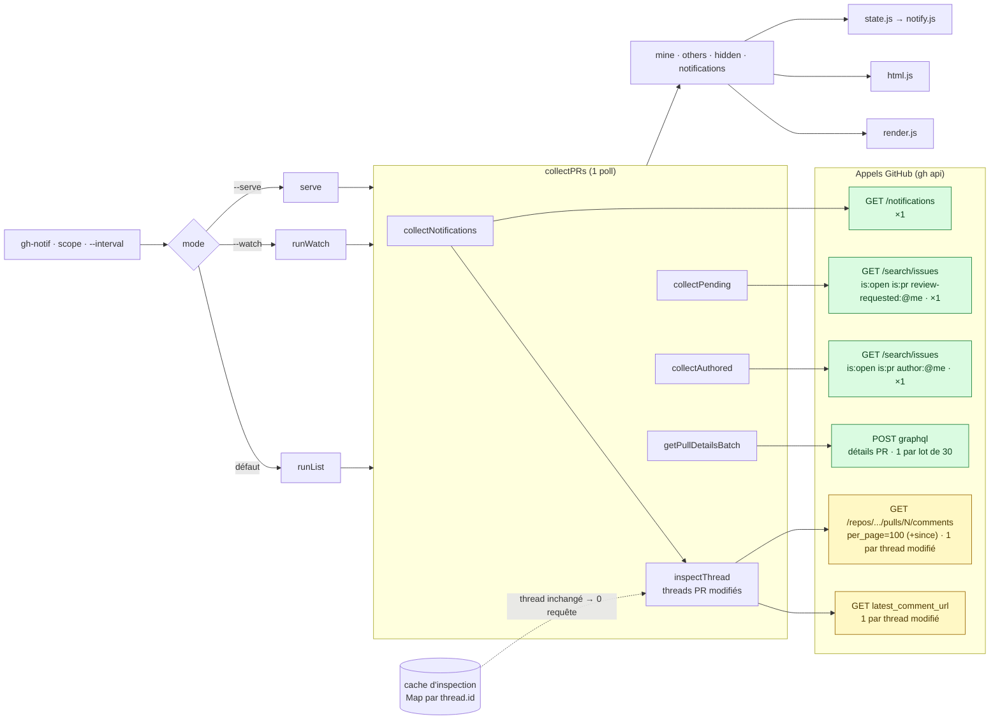
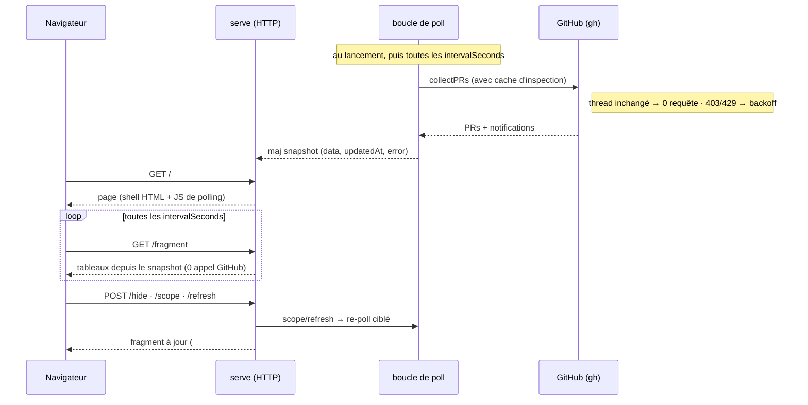

# Architecture — gh-notif (doc pour agents)

> Lis ce document **avant toute modification**. Il décrit les modules, le flux de données, et
> surtout les **décisions non-évidentes** (les pièges qui ont coûté des bugs). La spec de design
> complète est dans `docs/superpowers/specs/2026-06-24-gh-notif-design.md`.

## Vue d'ensemble

Extension `gh` CLI en **Node (ESM), zéro dépendance npm**. Un seul exécutable `gh-notif` qui
importe des modules `src/*.js`. Tous les accès GitHub passent par `gh` (via `child_process`), ce
qui réutilise l'auth de l'utilisateur. Tests avec le runner natif `node:test` (`npm test`).

## Modules et responsabilités

| Fichier | Rôle | Pur / testable ? |
|---------|------|------------------|
| `gh-notif` | Entrypoint : parse les args, résout le scope, dispatch `runList` / `runWatch` / `serve`. | non (I/O, boucle) |
| `src/github.js` | Wrapper fin autour de `gh` (`makeGh(runner)`), `runner` injectable. Renvoie du JSON brut. | oui via runner stub |
| `src/filter.js` | **Cœur** : `classify()` (règles de filtrage), `findReplyToMe()`, helpers. Fonctions pures. | oui |
| `src/collect.js` | Orchestration : agrège notifications + recherches en PRs, récupère les détails, scope. | oui via gh stub |
| `src/state.js` | Persistance + déduplication du `--watch`. | oui |
| `src/prefs.js` | Préférences UI persistées (`notify`, `theme`, `favorites`, `activeFav`, avec défauts/validation `isNotifyEnabled`/`themeOf`). Purs + I/O JSON, calqués sur `state.js`. | oui |
| `src/favorites.js` | Favoris de scope : normalisation/ajout/retrait, `parseScope`, cycle de la touche `f`, **`filterDataByScope`** (filtre d'affichage), `favoriteLabel` (`org/*`) et `favoriteCounts` (badges). Purs. | oui |
| `src/approvals.js` | Approbations sur mes PR : `approvalsOf`, seuil « prête à merger » (`isReady`), diff/seed des évènements (`diffApprovals`). Purs. | oui |
| `src/notify.js` | Notifs desktop multi-plateforme (`notifyCommand` : `notify-send` Linux / `osascript` macOS) + ligne d'évènement terminal. | oui via spawn stub |
| `src/render.js` | Tableaux encadrés alignés, couleur, liens OSC 8, helpers d'affichage. | oui |
| `src/spinner.js` | Spinner pendant les requêtes (stderr, no-op hors TTY). | oui via stream stub |
| `src/hidden.js` | Masquage des PR des autres : persistance, signatures d'évènements, réconciliation, numéros. | oui |
| `src/html.js` | Rendu **HTML pur** du mode `--serve` (`escapeHtml`, `renderFragment`, `renderShell`, `renderDebug`/`renderDebugShell`). Réutilise les helpers de `render.js`. | oui |
| `src/serve.js` | Serveur HTTP local (`node:http`) + boucle de poll : `handleRequest` (pur) + `serve` (I/O). | `handleRequest` oui ; `serve` non (I/O) |
| `src/ratelimit.js` | Détection rate-limit (`isRateLimitError`) + backoff (`nextBackoffSeconds`). Purs. | oui |

Chaque module a une responsabilité claire ; la logique difficile vit dans des **fonctions pures**
testées sur fixtures (pas d'appel réseau en test).

## Flux de données

Les trois modes (`gh notif`, `--watch`, `--serve`) partagent **le même cœur** `collectPRs` ; seule
la sortie diffère (tableaux terminal, boucle qui notifie, ou serveur web).

### Appels à GitHub (par poll)

Tous les accès passent par `gh` (auth réutilisée). Le schéma ci-dessous montre **chaque appel**,
sa **cardinalité** et son **coût** : en **vert** le *socle* (toujours émis, ~4 requêtes), en
**ambre** le coût *variable* (uniquement pour les threads de notification **modifiés** ; un thread
inchangé coûte **0 requête** grâce au cache).

`getCurrentUser` (`GET /user`) est appelé **une seule fois** au démarrage, hors boucle. Les trois
sources (`collectNotifications` / `collectPending` / `collectAuthored`) partent en `Promise.all` ;
l'inspection des threads tourne en `mapLimit(CONCURRENCY=6)`. Détail du cache, de l'incrémental
`since` et du backoff : cf. piège §11.

`--watch` : `runWatch` appelle `collectPRs` à chaque poll (mêmes données que `gh notif`) et
**redessine les deux tableaux** (`drawWatch` : efface l'écran en TTY puis `renderList`). La détection
des nouveautés se fait sur `data.notifications` (les items de notification, exposés par `collectPRs`)
via `state.js` ; chaque nouvel item déclenche `sendNotification` + une ligne `watchEventLine`
empilée dans un journal de session (max 8) affiché sous les tableaux. Puis `countdown` jusqu'au
prochain poll. Les reviews en attente / PR authored (issues de recherche) n'émettent **pas** de
notif desktop : seuls les items de `data.notifications` le font.

**Approbations sur mes PR** (`src/approvals.js`). Une approbation n'arrive **pas** par un thread
`/notifications` : elle vit dans les `reviews` GraphQL (déjà récupérées → coût nul). `collectPRs`
expose donc `data.approvalEvents` (un évènement `{repo,number,title,actor,url,submittedAt,count}`
par approbation, **seulement sur mes PR à l'état `open`** — pas draft/mergée/fermée). `--watch` et
`--serve` tiennent chacun un `Set seenApprovals` **en mémoire (par process)** + un flag
`primedApprovals` : `diffApprovals` fait un **amorçage silencieux au 1er poll** (on mémorise tout
sans notifier → pas de rafale au démarrage, même si un `seen-v2.json` existe déjà), puis renvoie les
approbations nouvelles → `sendNotification` (catégorie `APPROVAL`, suffixe `🎉 prête à merger` si
`count ≥ 2`). Le **badge `🎉`** dans la colonne ✅ (terminal + web) est un **état dérivé** (`isReady`,
≥ 2 sur PR ouverte) affiché indépendamment des notifs — donc visible aussi en one-shot `gh notif`.
État disque écarté pour les approbations (le seed mémoire suffit ; un redémarrage ré-amorce).

`--serve` : `serve` (`src/serve.js`) lance **une seule boucle de poll** (`collectPRs`, mêmes
données que `gh notif`, respecte la liste `hidden` persistée) alimentant un **snapshot en mémoire**
`{ data, updatedAt, error }`, et monte un serveur `node:http`. Les **lectures** (GET) sont routées
par `handleRequest(pathname, snapshot, {now, intervalMs, showHidden, scope})` (**pur**, testable
sans socket) : `GET /` → `renderShell` (page + JS de polling, champ de scope prérempli), `GET
/fragment` → `renderFragment` du snapshot (ou message d'erreur échappé ; `?hidden=1` ajoute les
lignes masquées), `GET /api/state` → JSON brut, sinon 404. Les **actions** (POST, effets de bord,
dans le handler I/O) : `POST /refresh` (force un poll, **débouncé** — cf. ci-dessous), `POST /hide?key=repo#n`
(`toggleHidden`+`saveHidden`, puis **recompute local** sans refetch), `POST /scope?value=` (scope
**mutable** : `parseScope` → re-fetch ciblé — le serveur ne charge que le scope choisi), `POST
/notify?enabled=0|1` (checkbox 🔔 de l'en-tête : bascule `notifyEnabled`), `POST /theme?value=auto|light|dark`
(switcher de thème : `themeOf` normalise, bascule `theme`). `/hide` et `/scope` renvoient le fragment
courant que le client injecte dans `#content` ; `/notify` et `/theme` renvoient **`204 No Content`**
(leurs widgets vivent dans le `<header>`, hors `#content` → inutile de re-rendre les tableaux ; ils
survivent d'eux-mêmes aux refresh du fragment).

**Préférences persistées (`prefs.js`, `prefs-v1.json`).** `serve` charge `prefs` **une fois** puis
en garde un **objet mutable en mémoire** ; `notifyEnabled`/`theme` en sont dérivés (`isNotifyEnabled`,
`themeOf`). ⚠️ Chaque action **mute cet objet et le ré-écrit EN ENTIER** (`prefs.notify = …; savePrefs(prefs)`)
— surtout **pas** `savePrefs({ notify })` : ça écraserait la clé `theme` (et inversement). Défauts
appliqués à la lecture (notifs activées, thème `auto`) → un fichier ancien/partiel reste valide.

**Coupure des notifs desktop (checkbox, persistée).** `notifyEnabled` est amorcé depuis
`prefs.js` (`isNotifyEnabled(loadPrefs(...))`, **activé par défaut**, survit au redémarrage). Quand
il est faux, `notifyNew` **continue** de consommer les évènements — `diffApprovals` remplit toujours
`seenApprovals`, `markSeen`/`saveState` sont toujours appelés — et **saute uniquement** les deux
`sendNotification`. Conséquence voulue : décocher = « marquer vu en silence », donc **recocher ne
provoque aucune rafale** de vieilles notifs (même philosophie que le seed silencieux, cf. §4). ⚠️ Ne
jamais court-circuiter `markSeen` derrière ce flag, sinon la file s'accumule et re-notifie tout au
ré-activation.

**Ctrl+R rafraîchit vraiment (et le stamp ne ment pas).** Au chargement de page, le client
affiche d'abord le snapshot (`GET /view`, 0 appel GitHub) **puis envoie `POST /refresh`** pour
forcer un vrai poll. Anti-spam côté serveur : `shouldRefresh(updatedAt, now)` (pur, exporté) —
snapshot **plus frais que 10 s** ⇒ `/refresh` répond la vue courante **sans re-poller** (spammer
ctrl+R ne spamme pas GitHub ; le bouton 🔄 subit le même débounce, voulu : des données de < 10 s
sont déjà fraîches). ⚠️ Le stamp `maj HH:MM:SS` affiche **`updatedAt` du snapshot** (l'heure du
vrai poll), jamais l'heure d'affichage — sinon un reload prétend une maj qu'il n'a pas faite
(bug réel). Le compteur « prochaine vérif » est calé sur le **prochain poll serveur estimé**
(`updatedAt + INTERVAL`, clampé ≥ 5 s), pas remis à plein à chaque injection.

Le rendu HTML (`src/html.js`) **réutilise** les helpers de présentation de `render.js`
(`ciIcon`, `stateIcon`, `relativeDate`) : seul le médium (terminal vs HTML) diffère. Le navigateur
re-fetch `/fragment` **au même rythme que le poll** (`intervalSeconds`, 60 s par défaut) ; ce
re-fetch ne fait que **relire le snapshot en mémoire** (0 appel GitHub), si bien que plusieurs
onglets ne multiplient pas les requêtes. Comme `--watch`, la boucle détecte les nouveautés
(`state.js` + `sendNotification`, seed silencieux au 1er run, gating `REVIEW_REQUEST` sur les PR
ouvertes). Style aux couleurs GitHub (Primer), tout inline (aucun asset externe).

**Thème CSS (auto/light/dark).** `renderShell` pose `data-theme` sur `<html>` **au rendu serveur**
(pas de flash au chargement). Les variables Primer ont une **source unique** (`LIGHT_VARS`/`DARK_VARS`
dans `html.js`) réutilisée dans 4 sélecteurs : `:root` (clair de base), `@media (prefers-color-scheme:
dark) :root[data-theme="auto"]` (auto suit le système), `:root[data-theme="light"]` et
`[data-theme="dark"]` (forçage). ⚠️ Astuce de spécificité : `[data-theme]` (0,1,1) l'emporte toujours
sur `:root` (0,0,1) **même** dans la media query (les media queries n'ajoutent pas de spécificité) →
`light`/`dark` gagnent quel que soit le système, `auto` seul suit la media query. Le switcher applique
`data-theme` côté client **immédiatement** (pas de reload) puis `POST /theme` persiste. ⚠️
`renderFragment` **échappe** toute donnée GitHub (titre, repo, auteur, clé de masquage) via
`escapeHtml` — un titre de PR peut contenir `<`/`&` (anti-injection).

## Formes de données

- **Thread** (`/notifications`) : `{ id, reason, updated_at, subject:{title,url,latest_comment_url,type}, repository:{full_name} }`
- **Item** (sortie de `classify`) : `{ category, actor, url, repo, number, title, threadId, updatedAt }`
- **Row** (sortie de `collectPRs`) : `{ repo, number, url, title, triggers:[…], author, createdAt, additions, deletions, ci, state, approvals }` — `state` ∈ {draft,open,merged,closed} (via `prState`), `approvals` = nb d'**approbations** (via `countApprovals` : users distincts dont la dernière review est APPROVED — pas `reviews.length`).
- **scope** : `null` (tout) | `{ type:'org', value }` | `{ type:'repo', value:'owner/name' }` | **tableau** de ces objets (union des favoris, cf. §14)

## Décisions non-évidentes (⚠️ pièges)

1. **La `reason` GitHub est « collante ».** Une PR où tu as été mentionné garde `reason: mention`,
   et une PR où tu as été ajouté comme reviewer garde `reason: review_requested` **à vie** — même
   après ta review, même quand l'évènement réel suivant est une réponse de quelqu'un d'autre ou une
   activité tierce (push/CI/review d'un autre). Donc `classify` ne fait **pas** confiance à la
   `reason` seule : il teste `findReplyToMe` **en premier** (signal le plus précis → `THREAD_REPLY`,
   prime sur review_requested ET mention), et ne retombe sur review_requested/mention/author
   qu'ensuite. `inspectThread` récupère **toujours** les review-comments (y compris pour
   `review_requested`), pas seulement pour `reason: comment`.

   **Corollaire (source d'autorité des reviews en attente).** Le trigger « review » du mode liste
   ne vient **jamais** d'une notification (collante, non fiable) : il vient exclusivement de
   `collectPending` → recherche `review-requested:@me`, que GitHub vide dès que tu reviews. En
   pratique `classify` peut émettre `REVIEW_REQUEST`, mais `collectPRs` l'**ignore** (absent de
   `TRIGGER_FOR`) ; cet item ne sert qu'au `--watch` (notifier une *nouvelle* demande de review).
   C'est ce qui évite qu'une PR déjà review (ex. réel : #7036) ré-apparaisse avec un trigger « review ».
   ⚠️ Côté `--watch`, on ne notifie un `REVIEW_REQUEST` que si la PR est **encore ouverte/pending**
   (présente dans `data.mine`/`data.others`, donc dans `collectPending` is:open) — sinon une demande
   de review sur une PR fermée/mergée déclencherait « Nouvelle PR à review » à tort (réel : #7004).

   **Commentaire (inline) sur MA PR.** Une notif `reason: author` n'a pas toujours de
   `latest_comment_url` pour un review-comment → la branche `author` de `classify` inspecte AUSSI les
   review-comments (`latestOtherComment`, filtré par `last_read_at`) pour émettre `ON_MY_PR` (réel :
   #7015). Les réponses à MON fil restent captées avant (THREAD_REPLY). Rappel : une notif déjà lue
   n'est pas récupérée par `gh notif` (all=false), donc un commentaire lu ne réapparaît pas.

   **Mention (collante aussi).** `reason: mention` reste à vie ; un re-bump du thread par un évènement
   **non-commentaire** (merge → réel #7014) ou par un **commentaire tiers** sans `@moi` ni réponse à
   mon fil (réel #6431) rendait la notif non-lue et ré-émettait une ligne « mention » à tort. La
   branche `mention` est donc durcie comme `author` : si `last_read_at` est défini (déjà lue), elle
   n'émet que s'il existe une **vraie `@moi`, par un autre, postérieure à ma lecture**
   (`latestMentionOfMe` / `mentionsMe`, sur `latestComment` + review-comments) ; sinon → bruit. Une
   notif **jamais lue** (`last_read_at` nul) reste émise telle quelle (mention réellement neuve).
   Limite connue : une mention dans le **corps de la PR** (non fetché) n'est pas détectée — marginal.

2. **GitHub aplatit les fils de review.** Toutes les réponses d'un fil pointent vers le commentaire
   **racine** (`in_reply_to_id` = racine), pas vers le commentaire précédent. `findReplyToMe`
   regroupe par racine, puis renvoie le commentaire d'un autre auteur **postérieur à mon dernier
   commentaire** du fil (pas juste « dans un fil où je suis »).

   **Filtre `since` = `last_read_at` (⚠️ sinon faux positif sur notif rebumpée).** `findReplyToMe`
   ignore aussi les réponses **antérieures ou égales à `last_read_at`** de la notification (passé par
   `classify`). Sans ça : une activité tierce qui ne me concerne pas (ex. un échange entre deux
   autres dans les commentaires principaux) rebumpe la notif, et on re-signale une **vieille réponse
   déjà lue** comme « t'a répondu » (régression réelle #6993). Une réponse n'est une nouveauté que si
   elle est postérieure à ma dernière lecture. `last_read_at` nul (jamais lue) ⇒ pas de filtre.

3. **Dédup du `--watch` par URL d'évènement, jamais par `updated_at`.** GitHub bump l'`updated_at`
   du thread à chaque activité ; déduper dessus re-notifie en boucle (re-« review demandée » dès
   qu'un autre commente, double-notif du même commentaire). On déduplique sur l'URL précise
   (`item.url`). Fichier d'état versionné `seen-v2.json` (un changement de clé impose un nouveau nom
   pour éviter un flot au passage).

4. **Premier run de `--watch` = seed silencieux.** Si le fichier d'état n'existe pas, on marque tout
   le backlog « vu » sans notifier ; on n'alerte que sur ce qui arrive ensuite.

5. **Largeur d'affichage des emojis (`render.js#displayWidth`).** L'alignement des tableaux en
   dépend entièrement. Règles : emoji large = 2 colonnes ; **sélecteur de variante `U+FE0F` = 0**,
   et une base suivie de `U+FE0F` (ex. `↩️`) compte 2 ; box-drawing et `−` (U+2212) = 1. Toute
   nouvelle icône doit être validée par le test d'alignement (toutes les lignes d'un tableau ont la
   même `displayWidth`). Ne pas réintroduire le bloc box-drawing dans `isWide`.

6. **Couleur / liens auto-désactivés hors TTY ou si `NO_COLOR`.** Rend la sortie non-TTY
   déterministe → les tests passent `{color:false, hyperlinks:false}` et asservissent la mise en page.

7. **« Tes PR » est un dashboard**, alimenté par `search author:@me is:open` (pas seulement par les
   notifications), sinon la section est vide quand personne n'a bougé sur tes PR.

   **Indépendance vis-à-vis de l'état merged/closed.** La logique n'interroge **jamais** l'état d'une
   PR (`getPullDetails` ne récupère pas `state`/`mergedAt`). Conséquence voulue : une review demandée
   sur une PR mergée disparaît (jamais dans `review-requested:@me is:open`, item review_requested
   ignoré), MAIS une réponse à un de mes fils reste visible même PR mergée (elle vient d'une
   notification → `THREAD_REPLY`, indépendant de l'état). Ne pas ajouter de filtre `is:open` côté
   notifications : ça masquerait les réponses sur PR fermées.

8. **Coût & parallélisme.** Les détails des PR (auteur/date/diff/CI/approbations) sont récupérés via
   **un batch GraphQL** (`getPullDetailsBatch`) : une requête par lot de 30 PR, avec un alias
   `p0,p1,…` par PR (`repository(owner,name){pullRequest(number){…}}`) et un fragment commun ; les
   lots tournent en parallèle (`Promise.all`). C'est l'évolution majeure : avant, un `gh pr view` par
   PR (~0,9 s pièce, process `gh` + multi-REST) dominait le temps. Mesures (scope de 17 PR, cold
   run) : `gh pr view` séquentiel ≈ 11,4 s → parallèle ≈ 5,8 s → **GraphQL batch ≈ 3,0 s**. Les 3
   sources (`collectNotifications`/`collectPending`/`collectAuthored`) tournent en `Promise.all` ;
   l'**inspection des notifications** (review-comments par thread) reste en `mapLimit` (avant :
   `await` séquentiel = goulot). `CONCURRENCY = 6` plafonne l'inspection pour ne pas heurter le
   **rate-limit secondaire** de GitHub (abaissé de 10→6 pour lisser le pic à froid). Le scope filtre
   **avant** ces appels. Spinner (`src/spinner.js`, stderr, no-op hors TTY) pendant l'attente. Voir
   le piège §11 pour le coût en **régime stable** (cache d'inspection) — ce §8 décrit le **cold run**.

   Le CI vient du `statusCheckRollup.state` du dernier commit (un seul état agrégé côté GitHub →
   `ciFromState`), et les approbations de `latestReviews`/`latestOpinionatedReviews` (→
   `countApprovals`), pas d'un tableau de checks REST.

9. **Apostrophes typographiques (`U+2019`).** Les libellés FR (`t'a répondu`, `t'a mentionné`)
   utilisent `'` (U+2019), pas l'ASCII `'`. Régression récurrente : vérifier les octets si tu touches
   ces chaînes. Les tests asservissent ça.

10. **Masquage « jusqu'au prochain trigger » (`hidden.js`).** Seules les PR de `others` sont
    masquables (jamais `mine` — garde explicite dans `collectPRs`). On stocke un instantané des
    **URLs d'évènements de trigger** (`signatureOf`, `review_request` exclu car absent de
    `TRIGGER_FOR`) au moment du masquage ; `reconcile` dé-masque dès qu'une URL nouvelle apparaît et
    élague les clés absentes des entrées courantes. Conséquence voulue : une review demandée
    (signature vide) reste cachée jusqu'à une vraie interaction (réponse/mention/commentaire) — une
    re-demande de review ne produit pas d'URL d'évènement, donc ne la fait pas réapparaître.
    `collectPRs` réconcilie et renvoie `{ others (visibles), hidden (lignes masquées), hiddenCount,
    hiddenChanged }`. L'interaction est **100 % clavier** : `h` entre en mode masquage (un rappel
    « appuie sur h » reste affiché), puis on tape le **numéro de la PR** (label = `assignLabels` =
    `String(row.number)`, colonne « PR ») + Entrée ; le mode se **referme dès qu'une PR est
    (dé)masquée** (`Esc` annule, `Backspace` corrige). En `--watch -v`, chaque masquage/restauration
    ajoute une ligne au journal de session. **Sans capture souris ni alt-screen** (essai souris
    abandonné car il cassait scroll/liens/curseur), et **seulement** si stdin+stdout sont des TTY — sinon
    « affiche puis rend la main ». En `--watch`, le poll est **gelé** pendant le mode masquage
    (`waitNextPoll` ne décompte ni n'écrit) pour ne pas redessiner sous l'utilisateur. État
    persisté dans `~/.local/state/gh-notif/hidden-v1.json`. ⚠️ `TRIGGER_FOR` vit dans `filter.js`
    (pas `collect.js`) pour être partagé avec `hidden.js` sans cycle d'import.

11. **Coût du poll & rate-limit (boucles longues).** Une collègue a été rate-limitée : un poll
    « naïf » émet ~50–70 requêtes, dominé à ~90 % par l'inspection par thread (`getComment` +
    `getReviewComments` paginé, pour *chaque* notification). En boucle longue (`serve.js`, `runWatch`),
    on injecte un **cache d'inspection** (`Map`, clé = `thread.id`) dans `collectPRs(..., { cache })` :
    - **thread inchangé** (même `thread.updated_at` que l'entrée de cache) ⇒ `inspectThread` renvoie
      l'inspection mémorisée, **0 requête** ;
    - **thread modifié** ⇒ on ne re-pagine pas : `getReviewComments(repo, n, { since: watermark })`
      ne ramène que le delta (`since` = max `updated_at` vu, via `watermarkOf`), fusionné avec le cache
      (`mergeReviewComments`, dédup par `id`, `fresh` gagne) ;
    - le cache est **élagué** des threads disparus de `/notifications`.
    Sans `cache` (le `gh notif` one-shot), comportement inchangé : toujours ré-inspecter. Forme d'une
    entrée : `{ threadUpdatedAt, since, inspection:{ latestComment, reviewComments } }`.
    **Backoff** (`src/ratelimit.js`, pur) : sur message d'erreur `gh` ressemblant à un rate-limit
    (`isRateLimitError` : `rate limit`/`secondary`/`abuse`/`403`/`429`), le prochain poll recule
    (`nextBackoffSeconds` : double, plafond 10 min) ; reset sur succès. `serve.js` reprogramme par
    **`setTimeout`** (pas `setInterval`) pour intégrer ce délai ; `runWatch` l'ajoute à `waitNextPoll`.
    Intervalle réglable par `--interval N`, **plancher 60 s** (`effectiveInterval`). ⚠️ Limite connue
    (hors périmètre) : l'incrémental `since` ne détecte pas un commentaire **supprimé** d'un fil déjà
    en cache.

12. **Mode debug = verdict du pipeline (coût nul).** `classify` délègue à
    **`classifyVerdict(thread, me, inspection) → { item, reason }`** (un `reason` à chacun des points
    de sortie) ; `classify` n'en garde que `item` (rétro-compatible). `collectNotifications` accepte
    un **sink** optionnel `debug` (array) et y pousse une entrée **compacte** par thread (reason GH,
    dates, `commentsCount`, `latestCommentAuthor`, `verdict {kept, category, reason}`) — **sans corps
    de commentaire** (coût + vie privée). `collectPRs` fournit **toujours** ce sink et renvoie
    `data.debug` : c'est gratuit (donnée déjà fetchée/calculée), donc **toujours capturé** ; seul
    l'affichage est gaté. Rendus : terminal `renderDebugText` (render.js, gaté par `--debug` dans
    `runList`/`runWatch`) ; web `renderDebug` + page autonome `renderDebugShell` (html.js), servies
    **always-on** en `--serve` via `/debug` (page), `/debug-fragment` (poll), `/api/debug` (JSON), avec
    un lien 🐛 dans l'en-tête. ⚠️ Contrainte produit : GitHub ne notifie **pas** tes propres actions →
    le debug montre le raisonnement, pas « tes messages ». ⚠️ `renderDebug` **échappe** toute donnée
    GitHub (titre, repo, raison) via `escapeHtml`.

13. **Notifs desktop multi-plateforme (`notify.js`).** Le choix de la commande est **pur** :
    `notifyCommand(platform, {title, body}) → {cmd, args}`. Linux → `notify-send [title, body]` ;
    **macOS** → `osascript -e 'display notification "…" with title "…"'`. `sendNotification` injecte
    `platform = process.platform` (surchargeable en test → les deux branches sont testées quelle que
    soit la machine CI). ⚠️ Pièges macOS/AppleScript : une source AppleScript **ne peut pas contenir
    de saut de ligne** dans un littéral de chaîne (le corps `…\n${url}` est donc **aplati en espaces**),
    et il faut échapper `\` **puis** `"` (dans cet ordre) sinon un titre de PR avec guillemets casse la
    commande. ⚠️ `sendNotification` attache **`child.on('error', …)`** (comme `openBrowser`) : sans ça,
    une commande absente (ENOENT) émet un évènement `error` non-géré qui **tue la boucle**
    `--watch`/`--serve`. Notifs restent **best-effort** (échec silencieux). Windows non couvert (retombe
    sur `notify-send`, absent → no-op silencieux).

14. **Favoris : on COLLECTE l'union, on FILTRE à l'affichage.** Un favori est un scope épinglé
    (`favorites: ["mapado","noctud/collection","zenstruck"]` dans `prefs-v1.json`). Dès qu'il en
    existe un, `collectPRs` reçoit un **tableau** de scopes — l'union — et le favori actif
    (`activeFav`) n'est qu'un **filtre d'affichage** (`filterDataByScope`) appliqué en aval.
    Conséquences voulues : les **notifs desktop de tous les favoris** arrivent en permanence même
    si on n'en regarde qu'un, et **changer de favori coûte 0 requête** (touche `f` en terminal,
    chips en web). ⚠️ **L'ordre est critique** :
    `collectPRs(union) → reconcile/hidden → notifyNew(data) → filterDataByScope(data, actif) → rendu`.
    Filtrer plus tôt casse trois choses à la fois : (a) `notifyNew`/`diffApprovals` perdraient les
    évènements des favoris inactifs — c'est *la* raison d'être de la feature ; (b) `reconcile`
    (§10) élague les clés absentes des entrées courantes, donc **effacerait le masquage** des
    favoris non affichés ; (c) `markSeen` (§3/§4) doit consommer **tous** les items, sinon la file
    s'accumule et re-notifie en rafale au changement de favori. En terminal comme en web, `data`
    reste donc **brut** en mémoire (c'est lui qui alimente le masquage) et seul le rendu est filtré.

    **Union en une seule recherche.** GitHub **OR-ise** les qualifiers de scope répétés — mesuré :
    `repo:zenstruck/foundry` (6) + `repo:symfony/panther` (9) → les deux ensemble **15** — y
    compris en mêlant `org:` et `repo:`. `scopesQualifier` concatène donc, et l'union ne coûte
    **pas** N recherches. `ensure()` dédupe déjà par `repo#number`, donc des favoris qui se
    recouvrent (`mapado` + `mapado/api`) ne produisent pas de doublon. ⚠️ Garde-fou : une query de
    recherche GitHub est **plafonnée à 256 caractères** ; `addFavorite` refuse au-delà de
    `MAX_QUALIFIER_LENGTH` (200). La contrainte est la **longueur, pas le nombre** — 10 favoris aux
    noms courts passent, 5 aux noms très longs non.

    **Priorité des scopes** : `--org`/`--repo` (ou le champ de scope web) → **mode ad-hoc**, ce
    scope seul, favoris hors-jeu (chips grisées, `adhoc: true`) ; sinon favoris s'il y en a ;
    sinon tout GitHub (comportement historique, strictement inchangé pour qui n'a aucun favori —
    `renderFavorites` d'une liste vide rend une chaîne vide). ⚠️ En mode ad-hoc, `handleRequest`
    ne re-filtre **pas** sur `activeFav` : la collecte a déjà fait le travail.

    **Persistance** : `favorites` + `activeFav` vivent dans `prefs-v1.json`, avec le piège habituel
    — muter l'objet `prefs` et le réécrire EN ENTIER (sinon `notify`/`theme` sautent). Pas de bump
    de version de fichier : `loadPrefs` applique les défauts à la lecture, un fichier antérieur
    reste valide. ⚠️ `favorites` étant un **tableau**, `loadPrefs` en recopie une instance fraîche
    (un `{...DEFAULTS}` nu partagerait la référence entre tous les appels).

    **Contrat HTTP du `--serve` (chips + tableaux ensemble).** La barre de favoris vit dans le
    `<header>` (hors `#content`) mais dépend des **données** (compteurs) : le poll client passe donc
    par **`GET /view` → JSON `{chips, fragment, updatedAt}`**, et toutes les actions POST
    (`/refresh`, `/hide`, `/scope`, `/fav`, `/fav/add`, `/fav/rm`) renvoient le **même JSON** — le
    client injecte les deux morceaux (`inject`). Seuls `/notify` et `/theme` restent en `204` (leur
    widget n'affiche aucune donnée). `GET /fragment` (HTML nu) subsiste pour compat/tests.
    ⚠️ **`/fav/add` et `/fav/rm` répondent AVANT le re-poll** : le refresh part en arrière-plan
    (`refresh().catch(…)`, jamais `await`) pour que la puce apparaisse instantanément ; le client
    **sonde `/view` jusqu'à ce que `updatedAt` change** (`chaseFresh`) pour voir compteurs et
    tableaux se poser. Re-`await`er ce refresh ferait réapparaître la latence d'origine (retour UX).

    **Lien « fermées ↗ » (historique de MES PR).** Aucune collecte ni pagination côté gh-notif :
    un simple lien externe (`closedPRsUrl`, pur, favorites.js) vers
    `github.com/pulls?q=is:pr author:@me is:closed + qualifiers`, dans le `<h2>` de « Tes PR »
    (`renderFragment`, opt `closedUrl`). Contextualisé sur ce que la vue **affiche**
    (`linkScopes`, serve.js) : ad-hoc > favori actif > union des favoris > rien. ⚠️ Distinct de
    `viewScope` (nul en ad-hoc et sur « tous »). Si `closedUrl` est fourni, la section « Tes PR »
    est rendue même vide (`(0)`, sans tableau) pour garder l'accès à l'historique ; sans lui
    (compat), comportement inchangé. Web (`--serve`) uniquement. Spec :
    `docs/superpowers/specs/2026-07-23-closed-prs-link-design.md`.

    **UI des favoris.** (a) **Compteur `(n)`** par chip = lignes d'« activité sur les PR des
    autres » (`data.others`, hors masquées) sous ce scope — **pas** `mine`, pas les triggers —
    calculé par `favoriteCounts` sur l'**union brute** : un favori inactif garde son compteur.
    (b) **Libellé** : une org s'affiche `mapado/*`, un dépôt `owner/name` (`favoriteLabel`) ;
    purement cosmétique, `data-fav`/valeur stockée/argument d'URL restent la chaîne **brute**.
    (c) **Existence vérifiée à l'ajout** (`gh.scopeExists`, CLI et web) : repo → `GET /repos/o/n`,
    org → `GET /users/x` (couvre orgs **et** users). Tri-état : `false` (404) → refus net (400 web /
    erreur CLI) ; **`null` (réseau, rate-limit…) → fail-open** avec avertissement — ne jamais
    bloquer un ajout légitime sur un incident transitoire. Les stubs `gh` sans `scopeExists`
    passent (garde `typeof`).

## Conventions de test

- Logique pure (`filter`, `render` helpers, `state`, `collect`, `ciRollup`, `scope`) : fixtures, pas
  de réseau. `github.js` testé via un `runner` stub qui capture les args passés à `gh`.
- Entrypoint (`gh-notif`) : pas de tests unitaires (I/O + boucle) → vérifié par smoke test manuel.
- Avant de conclure : `npm test` vert **et** `for f in gh-notif src/*.js test/*.js; do node --check "$f"; done`.
- Pour vérifier l'alignement réel : rendre la sortie, dépouiller ANSI/OSC, et confirmer que toutes
  les lignes d'un même tableau ont la même `displayWidth`.
