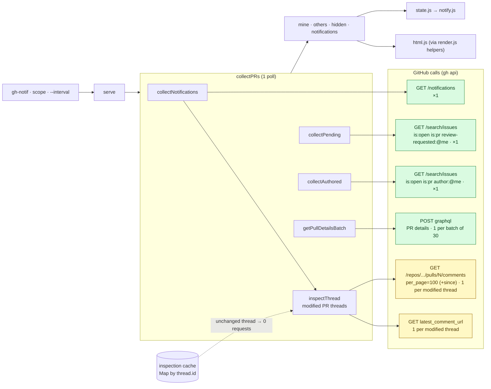
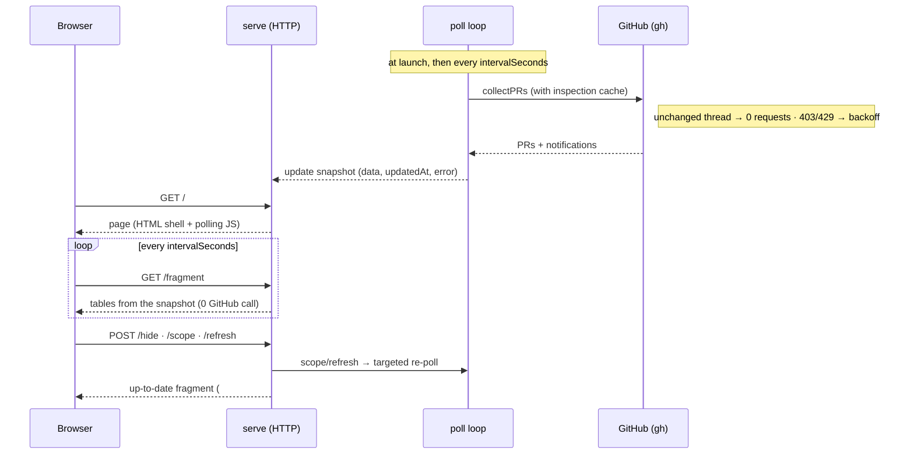

> # ⚠️ WARNING
> **This entire repository was vibe-coded.**

# Architecture — gh-notif (doc for agents)

> Read this document **before any modification**. It describes the modules, the data flow, and
> above all the **non-obvious decisions** (the traps that have cost bugs).

## Overview

`gh` CLI extension in **Node (ESM), zero npm dependency**. A single `gh-notif` executable that
imports `src/*.js` modules. All GitHub accesses go through `gh` (via `child_process`), which
reuses the user's auth. Tests with the native `node:test` runner (`npm test`).

**The only UI is a local web page** (`--serve` is the historical name; it is now the **default and
only** mode). Running `gh notif` starts the HTTP server and opens the browser. There is **no terminal
table rendering** anymore: the old one-shot list (`runList`) and `--watch` loop have been removed.
The entrypoint only: parses args, manages the `fav` subcommand, resolves the scope, and calls
`serve`. `--serve`/`--watch` are still **accepted as deprecated no-ops** (older invocations don't
error).

## Modules and responsibilities

| File | Role | Pure / testable? |
|---------|------|------------------|
| `gh-notif` | Entrypoint: parses args, handles the `fav` subcommand, resolves the scope, calls `serve` (the only mode). | no (I/O) |
| `src/github.js` | Thin wrapper around `gh` (`makeGh(runner)`), injectable `runner`. Returns raw JSON. | yes via runner stub |
| `src/filter.js` | **Core**: `classify()` (filtering rules), `findReplyToMe()`, helpers. Pure functions. | yes |
| `src/collect.js` | Orchestration: aggregates notifications + PR searches, fetches details, scope. | yes via gh stub |
| `src/state.js` | Persistence + deduplication of the poll-loop notifications. | yes |
| `src/prefs.js` | Persisted UI preferences (`notify`, `theme`, `favorites`, `activeFav`, `sort`, `ignoredChecks`, with defaults/validation `isNotifyEnabled`/`themeOf`/`ignoredChecksOf`/`ignoredChecksFor`). Pure + JSON I/O, modeled on `state.js`. | yes |
| `src/favorites.js` | Scope favorites: normalization/add/remove, `parseScope`, `f` key cycle, **`filterDataByScope`** (display filter), `favoriteLabel` (`org/*`) and `favoriteCounts` (badges). Pure. | yes |
| `src/approvals.js` | Approvals on my PRs: `approvalsOf`, « ready to merge » threshold (`isReady`), event diff/seed (`diffApprovals`). Pure. | yes |
| `src/notify.js` | Cross-platform desktop notifs (`notifyCommand`: `notify-send` Linux / `osascript` macOS). | yes via spawn stub |
| `src/render.js` | **Presentation helpers shared with the web** (`ciIcon`, `stateIcon`, `relativeDate`, `checksByRepo`) + the tiny terminal `favoritesBar` for `fav list`. No table rendering. | yes |
| `src/spinner.js` | Spinner during the server poll (stderr, no-op outside TTY). | yes via stream stub |
| `src/hidden.js` | Hiding of others' PRs: persistence, event signatures, reconciliation, numbers. | yes |
| `src/html.js` | **Pure HTML** rendering of the web page (`escapeHtml`, `renderFragment`, `renderShell`, `renderDebug`/`renderDebugShell`). Reuses the helpers of `render.js`. | yes |
| `src/serve.js` | Local HTTP server (`node:http`) + poll loop: `handleRequest` (pure) + `serve` (I/O). | `handleRequest` yes; `serve` no (I/O) |
| `src/ratelimit.js` | Rate-limit detection (`isRateLimitError`) + backoff (`nextBackoffSeconds`). Pure. | yes |
| `src/sort.js` | Sorting of the « others' PRs » table (web): `normalizeSort`, `toggleSort` (click cycle), `sortRows` (sorted copy, missing at the end). Pure. | yes |

Each module has a clear responsibility; the hard logic lives in **pure functions** tested on
fixtures (no network call in test).

## Data flow

There is a single mode: the web server (`serve`). It drives a poll loop over the core
`collectPRs`, feeds an in-memory snapshot, and renders it as HTML.

### Calls to GitHub (per poll)

All accesses go through `gh` (reused auth). The diagram below shows **each call**,
its **cardinality** and its **cost**: in **green** the *base* (always emitted, ~4 requests), in
**amber** the *variable* cost (only for **modified** notification threads; an unchanged thread
costs **0 requests** thanks to the cache).

`getCurrentUser` (`GET /user`) is called **only once** at startup, outside the loop. The three
sources (`collectNotifications` / `collectPending` / `collectAuthored`) go off in `Promise.all`;
the inspection of threads runs in `mapLimit(CONCURRENCY=6)`. Details of the cache, of the
incremental `since` and of the backoff: see trap §11.

**Server poll loop** (`serve.js`): `collectPRs` runs at each poll (with the inspection cache) and
feeds the in-memory snapshot. The detection of new items is done on `data.notifications` (the
notification items, exposed by `collectPRs`) via `state.js`; each new item triggers
`sendNotification`. Pending reviews / authored PRs (search issues) do **not** emit a desktop notif:
only the items of `data.notifications` do.

**Approvals on my PRs** (`src/approvals.js`). An approval does **not** arrive through a
`/notifications` thread: it lives in the GraphQL `reviews` (already fetched → zero cost). `collectPRs`
therefore exposes `data.approvalEvents` (one `{repo,number,title,actor,url,submittedAt,count}` event
per approval, **only on my PRs in the `open` state** — not draft/merged/closed). The server keeps a
`Set seenApprovals` **in memory (per process)** + a
`primedApprovals` flag: `diffApprovals` does a **silent seeding on the 1st poll** (we memorize everything
without notifying → no burst at startup, even if a `seen-v2.json` already exists), then returns the
new approvals → `sendNotification` (category `APPROVAL`, suffix `🎉 ready to merge` if
`count ≥ 2`). The **`🎉` badge** in the ✅ column (web) is a **derived state** (`isReady`,
≥ 2 on an open PR) shown independently of the notifs.
Disk state discarded for approvals (the memory seed is enough; a restart re-seeds).

`serve` opens the browser at startup (`openBrowser`, best-effort) **unless `--no-open`**
(option `open: false` of `serve()`) — to be used systematically for smoke tests, otherwise
each launch stacks a tab.

`serve` (`src/serve.js`) launches **a single poll loop** (`collectPRs`,
respecting the persisted `hidden` list) feeding an **in-memory snapshot**
`{ data, updatedAt, error }`, and mounts a `node:http` server. The **reads** (GET) are routed
by `handleRequest(pathname, snapshot, {now, intervalMs, showHidden, scope})` (**pure**, testable
without a socket): `GET /` → `renderShell` (page + polling JS, pre-filled scope field), `GET
/fragment` → `renderFragment` of the snapshot (or escaped error message; `?hidden=1` adds the
hidden rows), `GET /api/state` → raw JSON, otherwise 404. The **actions** (POST, side effects,
in the I/O handler): `POST /refresh` (forces a poll, **debounced** — see below), `POST /hide?key=repo#n`
(`toggleHidden`+`saveHidden`, then **local recompute** without a refetch), `POST /scope?value=` (scope
**mutable**: `parseScope` → targeted re-fetch — the server only loads the chosen scope), `POST
/notify?enabled=0|1` (🔔 checkbox of the header: toggles `notifyEnabled`), `POST /theme?value=auto|light|dark`
(theme switcher: `themeOf` normalizes, toggles `theme`). `/hide` and `/scope` return the current
fragment that the client injects into `#content`; `/notify` and `/theme` return **`204 No Content`**
(their widgets live in the `<header>`, outside `#content` → no need to re-render the tables; they
survive fragment refreshes on their own).

**Persisted preferences (`prefs.js`, `prefs-v1.json`).** `serve` loads `prefs` **once** then
keeps a **mutable object in memory**; `notifyEnabled`/`theme` are derived from it (`isNotifyEnabled`,
`themeOf`). ⚠️ Each action **mutates that object and rewrites it IN FULL** (`prefs.notify = …; savePrefs(prefs)`)
— definitely **not** `savePrefs({ notify })`: that would overwrite the `theme` key (and vice versa). Defaults
applied on read (notifs enabled, `auto` theme) → an old/partial file stays valid.

**Cutting desktop notifs (checkbox, persisted).** `notifyEnabled` is seeded from
`prefs.js` (`isNotifyEnabled(loadPrefs(...))`, **enabled by default**, survives restart). When
it is false, `notifyNew` **keeps** consuming the events — `diffApprovals` still fills
`seenApprovals`, `markSeen`/`saveState` are still called — and **only skips** the two
`sendNotification`. Intended consequence: unchecking = « mark seen silently », so **re-checking
causes no burst** of old notifs (same philosophy as the silent seed, cf. §4). ⚠️ Never
short-circuit `markSeen` behind this flag, otherwise the queue accumulates and re-notifies everything
on re-activation.

**Ctrl+R really refreshes (and the stamp doesn't lie).** On page load, the client
first displays the snapshot (`GET /view`, 0 GitHub call) **then sends `POST /refresh`** to
force a real poll. Server-side anti-spam: `shouldRefresh(updatedAt, now)` (pure, exported) —
snapshot **fresher than 10 s** ⇒ `/refresh` responds with the current view **without re-polling**
(spamming ctrl+R doesn't spam GitHub; the 🔄 button undergoes the same debounce, intended: data less than 10 s old
is already fresh). ⚠️ The `upd HH:MM:SS` stamp shows **the snapshot's `updatedAt`** (the time of the
real poll), never the display time — otherwise a reload would claim an update it didn't make
(real bug). The « next check » counter is aligned on the **estimated next server poll**
(`updatedAt + INTERVAL`, clamped ≥ 5 s), not reset to full on each injection.

The HTML rendering (`src/html.js`) **reuses** the presentation helpers of `render.js`
(`ciIcon`, `stateIcon`, `relativeDate`, `checksByRepo`): the display logic stays shared, only the
HTML formatting lives in html.js. The browser
re-fetches `/fragment` **at the same rhythm as the poll** (`intervalSeconds`, 60 s by default); this
re-fetch only **re-reads the in-memory snapshot** (0 GitHub call), so that multiple
tabs do not multiply the requests. The poll loop detects new items
(`state.js` + `sendNotification`, silent seed on the 1st run, gating `REVIEW_REQUEST` on open
PRs). Style in GitHub colors (Primer), all inline (no external asset).

**CSS theme (auto/light/dark).** `renderShell` sets `data-theme` on `<html>` **at server render**
(no flash on load). The Primer variables have a **single source** (`LIGHT_VARS`/`DARK_VARS`
in `html.js`) reused in 4 selectors: `:root` (base light), `@media (prefers-color-scheme:
dark) :root[data-theme="auto"]` (auto follows the system), `:root[data-theme="light"]` and
`[data-theme="dark"]` (forcing). ⚠️ Specificity trick: `[data-theme]` (0,1,1) always wins
over `:root` (0,0,1) **even** in the media query (media queries don't add specificity) →
`light`/`dark` win whatever the system, `auto` alone follows the media query. The switcher applies
`data-theme` client-side **immediately** (no reload) then `POST /theme` persists. ⚠️
`renderFragment` **escapes** all GitHub data (title, repo, author, hide key) via
`escapeHtml` — a PR title can contain `<`/`&` (anti-injection).

## Data shapes

- **Thread** (`/notifications`): `{ id, reason, updated_at, subject:{title,url,latest_comment_url,type}, repository:{full_name} }`
- **Item** (output of `classify`): `{ category, actor, url, repo, number, title, threadId, updatedAt }`
- **Row** (output of `collectPRs`): `{ repo, number, url, title, triggers:[…], author, createdAt, additions, deletions, ci, checks:[{name,state}], statusCheckRollupState, state, approvals, changesRequested }` — `state` ∈ {draft,open,merged,closed} (via `prState`), `approvals` = number of **approvals** (via `countApprovals`: distinct users whose last review is APPROVED — not `reviews.length`), `changesRequested` = number of distinct users whose **last review is CHANGES_REQUESTED** (via `changesRequestedOf`, mirror of `approvalsOf`; zero cost, same GraphQL `reviews`). In the ✅ column, a non-zero `changesRequested` appends the GitHub `file-diff` octicon in red (`--danger`) — shown **even at 0 approvals** (a request-changes with no approval is exactly the signal to surface), tooltip « N change(s) requested ». `checks` = individual CI jobs normalized (`state` ∈ {pass,fail,pending}), consumed by the debug view and the CI recompute (cf. §16). `ci` = aggregated verdict (`ciOf`: `ciFromState` by default; `ciFromChecks` if the repo has a blocklist). `statusCheckRollupState` = raw rollup, kept for the **local recompute** (`recomputeCi`) after a web toggle — allows falling back on `ciFromState` if the repo's blocklist becomes empty again.
- **scope**: `null` (everything) | `{ type:'org', value }` | `{ type:'repo', value:'owner/name' }` | **array** of these objects (union of favorites, cf. §14)

## Non-obvious decisions (⚠️ traps)

1. **The GitHub `reason` is « sticky ».** A PR where you were mentioned keeps `reason: mention`,
   and a PR where you were added as a reviewer keeps `reason: review_requested` **for life** — even
   after your review, even when the next real event is a reply from someone else or a
   third-party activity (push/CI/another's review). So `classify` does **not** trust the
   `reason` alone: it tests `findReplyToMe` **first** (the most precise signal → `THREAD_REPLY`,
   takes precedence over review_requested AND mention), and falls back on review_requested/mention/author
   only afterwards. `inspectThread` **always** fetches the review-comments (including for
   `review_requested`), not only for `reason: comment`.

   **Corollary (source of authority for pending reviews).** The « review » trigger of the tables
   never comes from a notification (sticky, unreliable): it comes exclusively from
   `collectPending` → `review-requested:@me` search, which GitHub empties as soon as you review. In
   practice `classify` can emit `REVIEW_REQUEST`, but `collectPRs` **ignores** it (absent from
   `TRIGGER_FOR`); this item only serves the poll loop's notifications (notify a *new* review request).
   That's what prevents an already-reviewed PR (real ex.: #7036) from re-appearing with a « review » trigger.
   ⚠️ On the notification side, we only notify a `REVIEW_REQUEST` if the PR is **still open/pending**
   (present in `data.mine`/`data.others`, thus in `collectPending` is:open) — otherwise a review request
   on a closed/merged PR would trigger « New PR to review » wrongly (real: #7004).

   **Comment (inline) on MY PR.** A `reason: author` notif doesn't always have a
   `latest_comment_url` for a review-comment → the `author` branch of `classify` ALSO inspects the
   review-comments (`latestOtherComment`, filtered by `last_read_at`) to emit `ON_MY_PR` (real:
   #7015). Replies to MY thread are still caught before (THREAD_REPLY). Reminder: an already-read notif
   is not fetched by `gh notif` (all=false), so a read comment does not reappear.

   **Mention (sticky too).** `reason: mention` stays for life; a re-bump of the thread by a
   **non-comment** event (merge → real #7014) or by a **third-party comment** without `@me` nor a reply to
   my thread (real #6431) made the notif unread and re-emitted a « mention » line wrongly. The
   `mention` branch is therefore hardened like `author`: if `last_read_at` is defined (already read), it
   emits only if there is a **real `@me`, by someone else, after my read**
   (`latestMentionOfMe` / `mentionsMe`, on `latestComment` + review-comments); otherwise → noise. A
   notif **never read** (`last_read_at` null) stays emitted as is (genuinely new mention). Known
   limitation: a mention in the **body of the PR** (not fetched) is not detected — marginal.

2. **GitHub flattens review threads.** All the replies of a thread point to the **root**
   comment (`in_reply_to_id` = root), not to the previous comment. `findReplyToMe`
   groups by root, then returns the comment of another author **after my last comment**
   of the thread (not just « in a thread where I am »).

   **`since` filter = `last_read_at` (⚠️ otherwise false positive on a re-bumped notif).** `findReplyToMe`
   also ignores replies **before or equal to `last_read_at`** of the notification (passed by
   `classify`). Without that: a third-party activity that doesn't concern me (e.g. an exchange between two
   others in the main comments) re-bumps the notif, and we re-report an **old reply
   already read** as « replied to you » (real regression #6993). A reply is a new item only if
   it is after my last read. `last_read_at` null (never read) ⇒ no filter.

3. **Dedup of the poll notifications by event URL, never by `updated_at`.** GitHub bumps the thread's `updated_at`
   at each activity; deduping on it re-notifies in a loop (re-« review requested » as soon
   as someone else comments, double-notif of the same comment). We deduplicate on the precise URL
   (`item.url`). Versioned state file `seen-v2.json` (a key change requires a new name
   to avoid a flood on the migration).

4. **First run of the poll loop = silent seed.** If the state file doesn't exist, we mark the whole
   backlog « seen » without notifying; we only alert on what comes afterwards.

5. **(Obsolete) Emoji display width.** This trap concerned the terminal boxed tables, which no
   longer exist (the only UI is the web page; CSS handles alignment). `render.js#displayWidth`,
   `truncate` and the framed-table machinery have been removed. Emoji are still used in the HTML
   icons, but their column width is no longer a correctness concern.

6. **Color / links auto-disabled outside TTY or if `NO_COLOR`.** Makes the non-TTY output
   deterministic → the tests pass `{color:false, hyperlinks:false}` and lock down the layout.

7. **« Your PRs » is a dashboard**, fed by `search author:@me is:open` (not only by the
   notifications), otherwise the section is empty when no one has moved on your PRs.

   **Independence from the merged/closed state.** The logic **never** queries the state of a
   PR (`getPullDetails` doesn't fetch `state`/`mergedAt`). Intended consequence: a review requested
   on a merged PR disappears (never in `review-requested:@me is:open`, review_requested item
   ignored), BUT a reply to one of my threads stays visible even on a merged PR (it comes from a
   notification → `THREAD_REPLY`, independent of the state). Do not add a `is:open` filter on the
   notifications side: that would hide replies on closed PRs.

8. **Cost & parallelism.** The PR details (author/date/diff/CI/approvals) are fetched via
   **one GraphQL batch** (`getPullDetailsBatch`): one request per batch of 30 PRs, with an alias
   `p0,p1,…` per PR (`repository(owner,name){pullRequest(number){…}}`) and a common fragment; the
   batches run in parallel (`Promise.all`). This is the major evolution: before, a `gh pr view` per
   PR (~0.9 s each, `gh` process + multi-REST) dominated the time. Measurements (scope of 17 PRs, cold
   run): sequential `gh pr view` ≈ 11.4 s → parallel ≈ 5.8 s → **GraphQL batch ≈ 3.0 s**. The 3
   sources (`collectNotifications`/`collectPending`/`collectAuthored`) run in `Promise.all`;
   the **inspection of notifications** (review-comments per thread) stays in `mapLimit` (before:
   sequential `await` = bottleneck). `CONCURRENCY = 6` caps the inspection to not hit the
   **secondary rate-limit** of GitHub (lowered from 10→6 to smooth the cold spike). The scope filters
   **before** these calls. Spinner (`src/spinner.js`, stderr, no-op outside TTY) during the wait. See
   trap §11 for the cost in **steady state** (inspection cache) — this §8 describes the **cold run**.

   The CI comes from the `statusCheckRollup.state` of the last commit (a single aggregated state on GitHub's side →
   `ciFromState`), and the approvals from `latestReviews`/`latestOpinionatedReviews` (→
   `countApprovals`), not from a REST array of checks. We ALSO fetch, **in the same request**
   (no extra round-trip), the `statusCheckRollup.contexts` (individual checks, `CheckRun`
   of Actions + `StatusContext` of commit) → normalized into `row.checks` for the CI recompute by
   blocklist (§16) and the debug view.

9. **Typographic apostrophes (`U+2019`).** The EN labels (`replied to you`, `mentioned you`)
   use `'` (U+2019), not the ASCII `'`. Recurrent regression: check the bytes if you touch
   these strings. The tests lock this down.

10. **Hiding « until the next trigger » (`hidden.js`).** Only the PRs of `others` are
    hideable (never `mine` — explicit guard in `collectPRs`). We store a snapshot of the
    **trigger event URLs** (`signatureOf`, `review_request` excluded because absent from
    `TRIGGER_FOR`) at the moment of hiding; `reconcile` un-hides as soon as a new URL appears and
    prunes the keys absent from the current entries. Intended consequence: a review requested
    (empty signature) stays hidden until a real interaction (reply/mention/comment) — a
    re-request of review produces no event URL, so does not make it reappear.
    `collectPRs` reconciles and returns `{ others (visible), hidden (hidden rows), hiddenCount,
    hiddenChanged }`. The interaction is **web-only**: a **✕** button on each « others » row
    → `POST /hide?key=repo#n` (`toggleHidden` + `saveHidden`, then a **local recompute** without a
    refetch, cf. §serve); the **🙈 hidden** toggle (`?hidden=1`) shows the hidden rows greyed out
    with a restore button. State persisted in `~/.local/state/gh-notif/hidden-v1.json`. ⚠️
    `TRIGGER_FOR` lives in `filter.js` (not `collect.js`) to be shared with `hidden.js` without an
    import cycle.

11. **Poll cost & rate-limit (long loops).** A colleague was rate-limited: a « naive » poll
    emits ~50–70 requests, dominated at ~90% by the per-thread inspection (`getComment` +
    paginated `getReviewComments`, for *each* notification). In the server poll loop (`serve.js`),
    we inject an **inspection cache** (`Map`, key = `thread.id`) into `collectPRs(..., { cache })`:
    - **unchanged thread** (same `thread.updated_at` as the cache entry) ⇒ `inspectThread` returns
      the memorized inspection, **0 requests**;
    - **modified thread** ⇒ we don't re-paginate: `getReviewComments(repo, n, { since: watermark })`
      only brings back the delta (`since` = max `updated_at` seen, via `watermarkOf`), merged with the cache
      (`mergeReviewComments`, dedup by `id`, `fresh` wins);
    - the cache is **pruned** of the threads that disappeared from `/notifications`.
    Called without `cache`, `collectPRs` always re-inspects (the cache is a poll-loop optimization).
    Shape of an entry: `{ threadUpdatedAt, since, inspection:{ latestComment, reviewComments } }`.
    **Backoff** (`src/ratelimit.js`, pure): on a `gh` error message resembling a rate-limit
    (`isRateLimitError`: `rate limit`/`secondary`/`abuse`/`403`/`429`), the next poll backs off
    (`nextBackoffSeconds`: doubles, cap 10 min); reset on success. `serve.js` reschedules via
    **`setTimeout`** (not `setInterval`) to incorporate this delay.
    Interval adjustable by `--interval N`, **floor 60 s** (`effectiveInterval`). ⚠️ Known limitation
    (out of scope): the incremental `since` does not detect a comment **deleted** from a thread already
    in the cache.

12. **Debug mode = pipeline verdict (zero cost).** `classify` delegates to
    **`classifyVerdict(thread, me, inspection) → { item, reason }`** (one `reason` at each of the exit
    points); `classify` only keeps `item` from it (backward-compatible). `collectNotifications` accepts
    an optional **sink** `debug` (array) and pushes a **compact** entry per thread onto it (GH reason,
    dates, `commentsCount`, `latestCommentAuthor`, `verdict {kept, category, reason}`) — **without a comment
    body** (cost + privacy). `collectPRs` **always** provides this sink and returns
    `data.debug`: it's free (data already fetched/computed), so **always captured**; only
    the display is gated. Rendering: web `renderDebug` + standalone page `renderDebugShell`
    (html.js), served **always-on** via `/debug` (page), `/debug-fragment` (poll), `/api/debug`
    (JSON), with a 🐛 link in the header. ⚠️ Product constraint: GitHub does **not** notify your own actions →
    the debug shows the reasoning, not « your messages ». ⚠️ `renderDebug` **escapes** all GitHub
    data (title, repo, reason) via `escapeHtml`. The debug view ALSO carries a **« Checks by
    repo »** section (`renderChecksSection` / `checksSectionText`): the blocklist being **per repo**, we present
    **per repo the DISTINCT set of its jobs** (`checksByRepo`: union over its PRs, order of 1st
    appearance) — **not** a list per PR (which would repeat each job and give the impression of a
    per-PR setting). The ignored ones are **struck through/greyed**. This is the source to copy the EXACT name of a
    job to put in a blocklist (§16). ⚠️ The **state** of a job being per PR, it is **not** shown here
    (config = per repo); the per-PR CI verdict stays in the main tables. Fed by
    `row.checks` (data already fetched, zero cost); ⚠️ the « no thread » early-return must NOT
    short-circuit this section (checks exist even without a notification thread) — both
    renderings add it AFTER the threads block. ⚠️ On the **web**, the section is **interactive**: each check
    is a **checkbox** (checked = ignored on the whole repo) that `POST /ignore-check?repo=&name=`
    (§16) — the `/debug` page (otherwise without any other POST action) has a **delegated** `change`
    handler on `#content` (re-injected at each poll). The check name travels in `data-repo`/`data-name` (HTML
    escaped) then `encodeURIComponent` on send.

13. **Cross-platform desktop notifs (`notify.js`).** The choice of the command is **pure**:
    `notifyCommand(platform, {title, body}) → {cmd, args}`. Linux → `notify-send [title, body]`;
    **macOS** → `osascript -e 'display notification "…" with title "…"'`. `sendNotification` injects
    `platform = process.platform` (overridable in test → both branches are tested whatever
    the CI machine). ⚠️ macOS/AppleScript traps: an AppleScript source **cannot contain
    a line break** in a string literal (the `…\n${url}` body is therefore **flattened into spaces**),
    and you must escape `\` **then** `"` (in that order) otherwise a PR title with quotes breaks the
    command. ⚠️ `sendNotification` attaches **`child.on('error', …)`** (like `openBrowser`): without it,
    an absent command (ENOENT) emits an unhandled `error` event that **kills the server poll loop**.
    Notifs stay **best-effort** (silent failure). Windows not covered (falls
    back on `notify-send`, absent → silent no-op).

14. **Favorites: we COLLECT the union, we FILTER at display.** A favorite is a pinned scope
    (`favorites: ["symfony","noctud/collection","zenstruck"]` in `prefs-v1.json`). As soon as there
    exists one, `collectPRs` receives an **array** of scopes — the union — and the active favorite
    (`activeFav`) is only a **display filter** (`filterDataByScope`) applied downstream.
    Intended consequences: the **desktop notifs of all the favorites** arrive continuously even
    if we only look at one, and **switching favorite costs 0 requests** (chips in the web header).
    ⚠️ **The order is critical**:
    `collectPRs(union) → reconcile/hidden → notifyNew(data) → filterDataByScope(data, active) → rendering`.
    Filtering earlier breaks three things at once: (a) `notifyNew`/`diffApprovals` would lose the
    events of the inactive favorites — that's *the* reason the feature exists; (b) `reconcile`
    (§10) prunes the keys absent from the current entries, so **would erase the hiding** of the
    non-displayed favorites; (c) `markSeen` (§3/§4) must consume **all** the items, otherwise the queue
    accumulates and re-notifies in a burst on the favorite change. `data`
    therefore stays **raw** in memory (it's what feeds the hiding) and only the rendering is filtered.

    **Union in a single search.** GitHub **OR-es** the repeated scope qualifiers — measured:
    `repo:zenstruck/foundry` (6) + `repo:symfony/panther` (9) → both together **15** — including
    when mixing `org:` and `repo:`. `scopesQualifier` therefore concatenates, and the union does **not**
    cost N searches. `ensure()` already dedupes by `repo#number`, so favorites that
    overlap (`symfony` + `symfony/api`) do not produce a duplicate. ⚠️ Safeguard: a GitHub
    search query is **capped at 256 characters**; `addFavorite` refuses beyond
    `MAX_QUALIFIER_LENGTH` (200). The constraint is the **length, not the number** — 10 favorites with
    short names pass, 5 with very long names don't.

    **Scope priority**: `--org`/`--repo` (or the web scope field) → **ad-hoc mode**, that
    scope alone, favorites out of play (greyed chips, `adhoc: true`); otherwise favorites if there are any;
    otherwise all of GitHub (historical behavior, strictly unchanged for whoever has no favorite —
    `renderFavorites` of an empty list renders an empty string). ⚠️ In ad-hoc mode, `handleRequest`
    does **not** re-filter on `activeFav`: the collection already did the work.

    **Persistence**: `favorites` + `activeFav` live in `prefs-v1.json`, with the usual trap
    — mutate the `prefs` object and rewrite it IN FULL (otherwise `notify`/`theme` are dropped). No bump
    of file version: `loadPrefs` applies the defaults on read, an earlier file
    stays valid. ⚠️ `favorites` being an **array**, `loadPrefs` copies a fresh instance of it
    (a bare `{...DEFAULTS}` would share the reference between all calls).

    **HTTP contract of `--serve` (chips + tables together).** The favorites bar lives in the
    `<header>` (outside `#content`) but depends on the **data** (counters): the client poll therefore goes
    through **`GET /view` → JSON `{chips, fragment, updatedAt}`**, and all the POST actions
    (`/refresh`, `/hide`, `/scope`, `/fav`, `/fav/add`, `/fav/rm`) return the **same JSON** — the
    client injects both pieces (`inject`). Only `/notify` and `/theme` stay in `204` (their
    widget displays no data). `GET /fragment` (bare HTML) remains for compat/tests.
    ⚠️ **`/fav/add` and `/fav/rm` respond BEFORE the re-poll**: the refresh goes off in the background
    (`refresh().catch(…)`, never `await`) so that the chip appears instantly; the client
    **polls `/view` until `updatedAt` changes** (`chaseFresh`) to see counters and
    tables settle. Re-`await`ing this refresh would bring back the original latency (UX regression).

    **« closed ↗ » link (history of MY PRs).** No collection nor pagination on the gh-notif side:
    a simple external link (`closedPRsUrl`, pure, favorites.js) toward
    `github.com/pulls?q=is:pr author:@me is:closed + qualifiers`, in the `<h2>` of « Your PRs »
    (`renderFragment`, opt `closedUrl`). Contextualized on what the view **displays**
    (`linkScopes`, serve.js): ad-hoc > active favorite > union of favorites > nothing. ⚠️ Distinct from
    `viewScope` (null in ad-hoc and on « all »). If `closedUrl` is provided, the « Your PRs » section
    is rendered even empty (`(0)`, without a table) to keep the access to the history; without it
    (compat), behavior unchanged. Web (`--serve`) only.

    **Favorites UI.** (a) **`(n)` counter** per chip = rows of « activity on others'
    PRs » (`data.others`, excluding hidden) under that scope — **not** `mine`, not the triggers —
    computed by `favoriteCounts` on the **raw union**: an inactive favorite keeps its counter.
    (b) **Label**: an org displays `symfony/*`, a repo `owner/name` (`favoriteLabel`);
    purely cosmetic, `data-fav`/stored value/URL argument stay the **raw** string.
    (c) **Existence verified on add** (`gh.scopeExists`, CLI and web): repo → `GET /repos/o/n`,
    org → `GET /users/x` (covers orgs **and** users). Tri-state: `false` (404) → clean refusal (400 web /
    CLI error); **`null` (network, rate-limit…) → fail-open** with a warning — never block a
    legitimate add on a transient incident. The `gh` stubs without `scopeExists`
    pass (`typeof` guard).

15. **Sorting of « others' PRs » (`--serve`) = display state, like the active favorite.** A single
    criterion `{key: date|approvals|author, dir}` (never a multi-column cumulation), persisted in
    `prefs-v1.json` (`sort` key, `null` by default — `normalizeSort` applies `{date, desc}` at
    usage, no migration). The sort applies in `fragmentBody` (serve.js), AFTER
    `filterDataByScope` and never at the collection — same critical order as §14 (`data` stays raw:
    hiding, notifs and favorite counters see no change). The hidden rows
    (`?hidden=1`) follow the same sort. `POST /sort?key=…` = `toggleSort` (same column → reverse;
    other → default direction: date `desc`, approvals `asc` — the least approved first —,
    author `asc`) + local recompute, **0 GitHub call**. Clickable headers rendered by
    `sortableTh` (html.js) **only if `opts.sort` is provided** to `renderFragment` — without it,
    output strictly unchanged (compat). The active column is
    **discreetly highlighted** (all cells) via a `<colgroup>` emitted by `table()`:
    the index of the `<col class="sorted">` is derived from the **same `headers` array** as the th (no
    hard-coded `nth-child` → cannot desynchronize); CSS `col.sorted` = veil
    `color-mix(accent 6%)` — the background of a `<col>` is painted **under** that of the rows, so the hover
    and the opacity of the hidden ones stay readable. Missing (`author`/
    `createdAt` null) at the end of the list whatever the direction; equality → arrival order (stable
    sort). « Your PRs » is never sortable.

16. **Ignored CI jobs (per-repo blocklist).** Some jobs are deliberately of little importance
    (e.g. `symfony/ticketing` → *Prevent merging with blocking label*, a reminder to run the
    migrations by hand); the GitHub rollup going `FAILURE` as soon as **one** check fails, they
    drowned the signal of the real job (`continuous-integration/jenkins/branch`). We therefore declare, **per
    repo**, a blocklist in `prefs-v1.json` (`ignoredChecks: { "owner/name": ["check name", …] }`,
    default `{}`, accessors `ignoredChecksOf`/`ignoredChecksFor`). `collectPRs(…, { ignoredChecks })`
    then recomputes `row.ci` via **`ciOf`** → **`ciFromChecks(checks, ignored)`** (pure, `collect.js`):
    removes the checks with the **exact trimmed name** (case sensitive), then aggregates (`fail` dominates → `pending` →
    `pass` → `none`). ⚠️ **Strong compat** — WITHOUT an entry for the repo, `ciOf` keeps exactly
    `ciFromState` (byte-identical verdict for whoever configured nothing; same spirit as §14/§15). The
    recompute only activates per configured repo. The name to put in a blocklist is the name of the **check**
    (≠ workflow name), to copy from the **« Checks by repo » section of the debug view** (§12).

    **Two ways to configure.** (a) **Web**: the checkboxes of the debug view (`POST /ignore-check`,
    §12) → `toggleIgnoredCheck(prefs, repo, name)` (pure, `prefs.js`: adds/removes, **deletes the
    repo key if empty**) + `savePrefs` + **`recomputeCi(snapshot.data, ignoredChecks)`** (local recompute of the
    `ci`, **0 GitHub call** — `row.checks` already in memory; same philosophy as `/hide` §10, `/sort`
    §15). The response is the **re-rendered debug fragment**; the dashboard picks up the CI icons at its
    next `/view` (same `snapshot.data`). ⚠️ `ignoredChecks` is **mutable** in memory (re-toggled
    by the POST). (b) **Manual**: edit `prefs-v1.json`. ⚠️ Editing by hand while the server
    is running would be overwritten at the next POST (`prefs` object rewritten in full, §14) →
    edit with the app stopped then relaunch. The individual checks come from the
    `statusCheckRollup.contexts` (§8, same request).

## Test conventions

- Pure logic (`filter`, `render` helpers, `state`, `collect`, `ciRollup`, `scope`): fixtures, no
  network. `github.js` tested via a `runner` stub that captures the args passed to `gh`.
- Entrypoint (`gh-notif`): no unit tests (I/O) → verified by a manual smoke test (launch with
  `--no-open`, curl `/`, `/fragment`, `/debug`, `/api/state`, then stop the process).
- Before concluding: `npm test` green **and** `for f in gh-notif src/*.js test/*.js; do node --check "$f"; done`.
- Every smoke test of the server **MUST pass `--no-open`** (otherwise each launch opens a browser tab).
