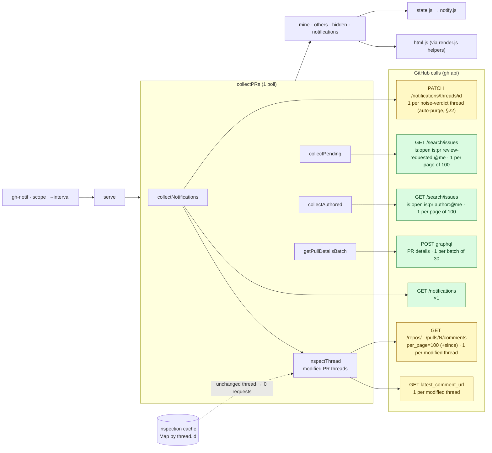
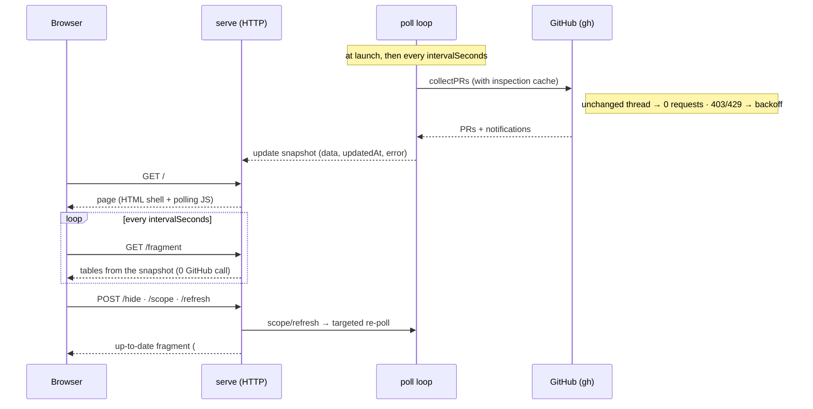

> # ⚠️ WARNING
> **This entire repository was vibe-coded.**

# Architecture — gh-notif (doc for agents)

> Read this document **before any modification**. It describes the modules, the data flow, and
> above all the **non-obvious decisions** (the traps that have cost bugs).

## Overview

`gh` CLI extension in **Node (ESM), zero npm dependency**. A single `gh-notif` executable that
imports `src/*.js` modules. All GitHub accesses go through `gh` (via `child_process`), which
reuses the user's auth. Tests with the native `node:test` runner (`npm test`).

**The only UI is a local web page** (`--serve` is the historical name; it is now the **default and
only** mode). Running `gh notif` starts the HTTP server and opens the browser. There is **no terminal
table rendering** anymore: the old one-shot list (`runList`) and `--watch` loop have been removed.
The entrypoint only: parses args, manages the `fav` subcommand, resolves the scope, and calls
`serve`. `--serve`/`--watch` are still **accepted as deprecated no-ops** (older invocations don't
error).

## Modules and responsibilities

| File | Role | Pure / testable? |
|---------|------|------------------|
| `gh-notif` | Entrypoint: parses args, handles the `fav` subcommand, resolves the scope, calls `serve` (the only mode). | no (I/O) |
| `src/github.js` | Thin wrapper around `gh` (`makeGh(runner)`), injectable `runner`. Returns raw JSON. | yes via runner stub |
| `src/filter.js` | **Core**: `classify()` (filtering rules), `findReplyToMe()`, helpers. Pure functions. | yes |
| `src/collect.js` | Orchestration: aggregates notifications + PR searches, fetches details, scope. | yes via gh stub |
| `src/state.js` | Persistence + deduplication of the poll-loop notifications. | yes |
| `src/prefs.js` | Persisted UI preferences (`notify`, `theme`, `favorites`, `activeFav`, `sort`, `sortMine`, `ignoredChecks`, `favModes`, with defaults/validation `isNotifyEnabled`/`themeOf`/`ignoredChecksOf`/`ignoredChecksFor`/`favModesOf`/`toggleFavMode`). Pure + JSON I/O, modeled on `state.js`. | yes |
| `src/favorites.js` | Scope favorites: normalization/add/remove, `parseScope`, `f` key cycle, **`filterDataByScope`** (display filter), `favoriteLabel` (`org/*`), `favoriteCounts` (badges) and `repoInAllMode` (« all » mode, §18). Pure. | yes |
| `src/approvals.js` | Approvals on my PRs: `approvalsOf`, « ready to merge » threshold (`isReady`), event diff/seed (`diffApprovals`). Pure. | yes |
| `src/notify.js` | Cross-platform desktop notifs (`notifyCommand`: `notify-send` Linux / `osascript` macOS). | yes via spawn stub |
| `src/render.js` | **Presentation helpers shared with the web** (`ciIcon`, `stateIcon`, `relativeDate`, `checksByRepo`) + the tiny terminal `favoritesBar` for `fav list`. No table rendering. | yes |
| `src/spinner.js` | Spinner during the server poll (stderr, no-op outside TTY). | yes via stream stub |
| `src/hidden.js` | Hiding of PRs (others' and mine): persistence, event signatures, reconciliation, numbers. | yes |
| `src/html.js` | **Pure HTML** rendering of the web page (`escapeHtml`, `renderFragment`, `renderShell`, `renderDebug`/`renderDebugShell`). Reuses the helpers of `render.js`. | yes |
| `src/serve.js` | Local HTTP server (`node:http`) + poll loop: `handleRequest` (pure) + `serve` (I/O). | `handleRequest` yes; `serve` no (I/O) |
| `src/ratelimit.js` | Rate-limit detection (`isRateLimitError`) + backoff (`nextBackoffSeconds`). Pure. | yes |
| `src/sort.js` | Sorting of the web tables (« others » AND « Your PRs », each with its own key set): `normalizeSort`, `toggleSort` (click cycle), `sortRows` (sorted copy, missing at the end). Pure. | yes |

Each module has a clear responsibility; the hard logic lives in **pure functions** tested on
fixtures (no network call in test).

## Data flow

There is a single mode: the web server (`serve`). It drives a poll loop over the core
`collectPRs`, feeds an in-memory snapshot, and renders it as HTML.

### Calls to GitHub (per poll)

All accesses go through `gh` (reused auth). The diagram below shows **each call**,
its **cardinality** and its **cost**: in **green** the *base* (always emitted, ~4 requests), in
**amber** the *variable* cost (only for **modified** notification threads; an unchanged thread
costs **0 requests** thanks to the cache).

```mermaid
flowchart LR
  CLI["gh-notif · scope · --interval"] --> Serve[serve]
  Serve --> Collect

  subgraph Collect["collectPRs (1 poll)"]
    direction TB
    N[collectNotifications] --> INS["inspectThread<br/>modified PR threads"]
    P[collectPending]
    A[collectAuthored]
    B[getPullDetailsBatch]
  end

  subgraph GH["GitHub calls (gh api)"]
    direction TB
    E1["GET /notifications<br/>×1"]
    E2["GET /search/issues<br/>is:open is:pr review-requested:@me · 1 per page of 100"]
    E3["GET /search/issues<br/>is:open is:pr author:@me · 1 per page of 100"]
    E4["POST graphql<br/>PR details · 1 per batch of 30"]
    E5["GET latest_comment_url<br/>1 per modified thread"]
    E6["GET /repos/.../pulls/N/comments<br/>per_page=100 (+since) · 1 per modified thread"]
    E7["PATCH /notifications/threads/id<br/>1 per noise-verdict thread (auto-purge, §22)"]
  end

  N --> E1
  P --> E2
  A --> E3
  B --> E4
  INS --> E5
  INS --> E6
  N --> E7
  Cache[("inspection cache<br/>Map by thread.id")] -. "unchanged thread → 0 requests" .-> INS

  Collect --> Out["mine · others · hidden · notifications"]
  Out --> HT["html.js (via render.js helpers)"]
  Out --> ST["state.js → notify.js"]

  classDef socle fill:#dafbe1,stroke:#1a7f37,color:#0a3d1a;
  classDef variable fill:#fff8c5,stroke:#9a6700,color:#4d3800;
  class E1,E2,E3,E4 socle;
  class E5,E6,E7 variable;
```

`getCurrentUser` (`GET /user`) is called **only once** at startup, outside the loop. The three
sources (`collectNotifications` / `collectPending` / `collectAuthored`) go off in `Promise.all`;
the inspection of threads runs in `mapLimit(CONCURRENCY=6)`. Details of the cache, of the
incremental `since` and of the backoff: see trap §11.

**Server poll loop** (`serve.js`): `collectPRs` runs at each poll (with the inspection cache) and
feeds the in-memory snapshot. The detection of new items is done on `data.notifications` (the
notification items, exposed by `collectPRs`) via `state.js`; each new item triggers
`sendNotification`. Pending reviews / authored PRs (search issues) do **not** emit a desktop notif:
only the items of `data.notifications` do.

**Approvals on my PRs** (`src/approvals.js`). An approval does **not** arrive through a
`/notifications` thread: it lives in the GraphQL `reviews` (already fetched → zero cost). `collectPRs`
therefore exposes `data.approvalEvents` (one `{repo,number,title,actor,url,submittedAt,count}` event
per approval, **only on my PRs in the `open` state** — not draft/merged/closed). The server keeps a
`Set seenApprovals` **in memory (per process)** + a
`primedApprovals` flag: `diffApprovals` does a **silent seeding on the 1st poll** (we memorize everything
without notifying → no burst at startup, even if a `seen-v2.json` already exists), then returns the
new approvals → `sendNotification` (category `APPROVAL`, suffix `🎉 ready to merge` if
`count ≥ 2`). The **`🎉` badge** in the ✅ column (web) is a **derived state** (`isReady`,
≥ 2 on an open PR) shown independently of the notifs.
Disk state discarded for approvals (the memory seed is enough; a restart re-seeds).

`serve` opens the browser at startup (`openBrowser`, best-effort) **unless `--no-open`**
(option `open: false` of `serve()`) — to be used systematically for smoke tests, otherwise
each launch stacks a tab.

`serve` (`src/serve.js`) launches **a single poll loop** (`collectPRs`,
respecting the persisted `hidden` list) feeding an **in-memory snapshot**
`{ data, updatedAt, error }`, and mounts a `node:http` server. The **reads** (GET) are routed
by `handleRequest(pathname, snapshot, {now, intervalMs, showHidden, scope})` (**pure**, testable
without a socket): `GET /` → `renderShell` (page + polling JS, pre-filled scope field), `GET
/fragment` → `renderFragment` of the snapshot (or escaped error message; `?hidden=1` adds the
hidden rows), `GET /api/state` → raw JSON, otherwise 404. The **actions** (POST, side effects,
in the I/O handler): `POST /refresh` (forces a poll, **debounced** — see below), `POST /hide?key=repo#n`
(`toggleHidden`+`saveHidden`, then **local recompute** without a refetch), `POST /scope?value=` (scope
**mutable**: `parseScope` → targeted re-fetch — the server only loads the chosen scope), `POST
/notify?enabled=0|1` (🔔 checkbox of the header: toggles `notifyEnabled`), `POST /theme?value=auto|light|dark`
(theme switcher: `themeOf` normalizes, toggles `theme`). `/hide` and `/scope` return the current
fragment that the client injects into `#content`; `/notify` and `/theme` return **`204 No Content`**
(their widgets live in the `<header>`, outside `#content` → no need to re-render the tables; they
survive fragment refreshes on their own).

**Persisted preferences (`prefs.js`, `prefs-v1.json`).** `serve` loads `prefs` **once** then
keeps a **mutable object in memory**; `notifyEnabled`/`theme` are derived from it (`isNotifyEnabled`,
`themeOf`). ⚠️ Each action **mutates that object and rewrites it IN FULL** (`prefs.notify = …; savePrefs(prefs)`)
— definitely **not** `savePrefs({ notify })`: that would overwrite the `theme` key (and vice versa). Defaults
applied on read (notifs enabled, `auto` theme) → an old/partial file stays valid.

**Cutting desktop notifs (checkbox, persisted).** `notifyEnabled` is seeded from
`prefs.js` (`isNotifyEnabled(loadPrefs(...))`, **enabled by default**, survives restart). When
it is false, `notifyNew` **keeps** consuming the events — `diffApprovals` still fills
`seenApprovals`, `markSeen`/`saveState` are still called — and **only skips** the two
`sendNotification`. Intended consequence: unchecking = « mark seen silently », so **re-checking
causes no burst** of old notifs (same philosophy as the silent seed, cf. §4). ⚠️ Never
short-circuit `markSeen` behind this flag, otherwise the queue accumulates and re-notifies everything
on re-activation.

**Ctrl+R really refreshes (and the stamp doesn't lie).** On page load, the client
first displays the snapshot (`GET /view`, 0 GitHub call) **then sends `POST /refresh`** to
force a real poll. Server-side anti-spam: `shouldRefresh(updatedAt, now)` (pure, exported) —
snapshot **fresher than 10 s** ⇒ `/refresh` responds with the current view **without re-polling**
(spamming ctrl+R doesn't spam GitHub; the 🔄 button undergoes the same debounce, intended: data less than 10 s old
is already fresh). ⚠️ The `upd HH:MM:SS` stamp shows **the snapshot's `updatedAt`** (the time of the
real poll), never the display time — otherwise a reload would claim an update it didn't make
(real bug). The « next check » counter is aligned on the **estimated next server poll**
(`updatedAt + INTERVAL`, clamped ≥ 5 s), not reset to full on each injection.

**A restart must show the restored view, not a stale browser copy (real bug).** The server
restores `activeFav` from prefs at startup, but the browser could still show a long-gone
ad-hoc state (old scope pre-filled in the filter field, greyed chips): the responses carried
no `Cache-Control` (heuristic caching could resurrect a `/` shell captured in ad-hoc mode),
and browsers restore user-typed form values on reload/session restore. Two guards: **every**
HTTP response carries `Cache-Control: no-store` (in `send`, serve.js), and the client forces
`scopeInput.value = scopeInput.defaultValue` at boot (`defaultValue` IS the server-rendered
`value=""` attribute) with `autocomplete="off"` on the field.

The HTML rendering (`src/html.js`) **reuses** the presentation helpers of `render.js`
(`ciIcon`, `stateIcon`, `relativeDate`, `checksByRepo`): the display logic stays shared, only the
HTML formatting lives in html.js. The browser
re-fetches `/fragment` **at the same rhythm as the poll** (`intervalSeconds`, 60 s by default); this
re-fetch only **re-reads the in-memory snapshot** (0 GitHub call), so that multiple
tabs do not multiply the requests. The poll loop detects new items
(`state.js` + `sendNotification`, silent seed on the 1st run, gating `REVIEW_REQUEST` on open
PRs). Style in GitHub colors (Primer), all inline (no external asset).

**CSS theme (auto/light/dark).** `renderShell` sets `data-theme` on `<html>` **at server render**
(no flash on load). The Primer variables have a **single source** (`LIGHT_VARS`/`DARK_VARS`
in `html.js`) reused in 4 selectors: `:root` (base light), `@media (prefers-color-scheme:
dark) :root[data-theme="auto"]` (auto follows the system), `:root[data-theme="light"]` and
`[data-theme="dark"]` (forcing). ⚠️ Specificity trick: `[data-theme]` (0,1,1) always wins
over `:root` (0,0,1) **even** in the media query (media queries don't add specificity) →
`light`/`dark` win whatever the system, `auto` alone follows the media query. The switcher applies
`data-theme` client-side **immediately** (no reload) then `POST /theme` persists. ⚠️
`renderFragment` **escapes** all GitHub data (title, repo, author, hide key) via
`escapeHtml` — a PR title can contain `<`/`&` (anti-injection).

```mermaid
sequenceDiagram
  participant B as Browser
  participant S as serve (HTTP)
  participant L as poll loop
  participant G as GitHub (gh)

  Note over L: at launch, then every intervalSeconds
  L->>G: collectPRs (with inspection cache)
  Note right of G: unchanged thread → 0 requests · 403/429 → backoff
  G-->>L: PRs + notifications
  L-->>S: update snapshot (data, updatedAt, error)

  B->>S: GET /
  S-->>B: page (HTML shell + polling JS)
  loop every intervalSeconds
    B->>S: GET /fragment
    S-->>B: tables from the snapshot (0 GitHub call)
  end

  B->>S: POST /hide · /scope · /refresh
  S->>L: scope/refresh → targeted re-poll
  S-->>B: up-to-date fragment (#content replaced)
```

## Data shapes

- **Thread** (`/notifications`): `{ id, reason, updated_at, subject:{title,url,latest_comment_url,type}, repository:{full_name} }`
- **Item** (output of `classify`): `{ category, actor, url, repo, number, title, threadId, updatedAt }` — the watch items (« all » mode, §18) also carry `subjectType` (`'issue' | 'pull'`) and `createdAt` (creation date, null for an activity)
- **Issue row** (`data.issues`, « all » mode only, §18): `{ repo, number, title, url, actor, createdAt, updatedAt, triggers:[…] }` — no CI/diff/approvals (meaningless for an issue), no hiding in v1
- **Row** (output of `collectPRs`): `{ repo, number, url, title, triggers:[…], author, branch, branchRepo, base, defaultBranch, createdAt, readyAt, updatedAt, additions, deletions, diffTypes, moreFiles, ci, checks:[{name,state}], statusCheckRollupState, state, conflicting, approvals, changesRequested }` — `readyAt` = date of the last draft → « ready for review » transition (GraphQL `timelineItems`, same batch; null if never draft), consumed by the easter-egg business-days gate (§21) and by the « In review » column (§26) — `branch` = the PR's `headRefName` and `branchRepo` = `headRepository.nameWithOwner` (same GraphQL batch, zero extra cost; null if missing), shown in the web « Branch » column as a small GitHub-like ref chip linking to the branch tree on the head repo (the fork for external PRs; fallback on `repo` if the fork is gone) with a copy button — `state` ∈ {draft,open,merged,closed} (via `prState`), `approvals` = number of **approvals** (via `countApprovals`: distinct users whose last review is APPROVED — not `reviews.length`), `changesRequested` = number of distinct users whose **last review is CHANGES_REQUESTED** (via `changesRequestedOf`, mirror of `approvalsOf`; zero cost, same GraphQL `reviews`). In the ✅ column, a non-zero `changesRequested` appends the GitHub `file-diff` octicon in red (`--danger`) — shown **even at 0 approvals** (a request-changes with no approval is exactly the signal to surface), tooltip « N change(s) requested ». `labels` = the PR's GitHub labels (`[{name, color}]`, `color` = 6-digit hex **without** `#`, same GraphQL batch, zero extra cost) — shown in the « Labels » column as GitHub-look pills (§25). `checks` = individual CI jobs normalized (`{name, state, url}`, `state` ∈ {pass,fail,pending}, `url` = run page — CheckRun `detailsUrl` / StatusContext `targetUrl`, null if absent), consumed by the debug view, the CI recompute (cf. §16) and the CI checks popover (cf. §17). `ci` = aggregated verdict (`ciOf`: `ciFromState` by default; `ciFromChecks` if the repo has a blocklist). `statusCheckRollupState` = raw rollup, kept for the **local recompute** (`recomputeCi`) after a web toggle — allows falling back on `ciFromState` if the repo's blocklist becomes empty again. `conflicting` = the PR conflicts with its base branch: it comes from the GraphQL field `mergeable` (same batch, zero extra cost) and is true **only** for an explicit `CONFLICTING`. ⚠️ GitHub computes the merge commit **lazily**: the first read after a push returns `UNKNOWN` and merely *triggers* the computation — the next poll gives the verdict. Testing `mergeable !== 'MERGEABLE'` would therefore flash a false conflict on every fresh push. Shown in the 🚦 column, next to the state icon: a ⚠️, tooltip « Merge conflicts » — no column of its own (both tables would widen for a rare case). ⚠️ An **emoji**, not an octicon: the state icon is itself an emoji (📝🟢🟣🔴) and an inline SVG never lines up next to one (an emoji carries its own metrics and sits low in its box — neither `vertical-align` nor an `inline-flex` centring the boxes fixes it; both were tried and shipped visibly off).
- **scope**: `null` (everything) | `{ type:'org', value }` | `{ type:'repo', value:'owner/name' }` | **array** of these objects (union of favorites, cf. §14)

## Non-obvious decisions (⚠️ traps)

1. **The GitHub `reason` is « sticky ».** A PR where you were mentioned keeps `reason: mention`,
   and a PR where you were added as a reviewer keeps `reason: review_requested` **for life** — even
   after your review, even when the next real event is a reply from someone else or a
   third-party activity (push/CI/another's review). So `classify` does **not** trust the
   `reason` alone: it tests `findReplyToMe` **first** (the most precise signal → `THREAD_REPLY`,
   takes precedence over review_requested AND mention), and falls back on review_requested/mention/author
   only afterwards. `inspectThread` **always** fetches the review-comments (including for
   `review_requested`), not only for `reason: comment`.

   **Corollary (source of authority for pending reviews).** The « review » trigger of the tables
   never comes from a notification (sticky, unreliable): it comes exclusively from
   `collectPending` → `review-requested:@me` search, which GitHub empties as soon as you review. In
   practice `classify` can emit `REVIEW_REQUEST`, but `collectPRs` **ignores** it (absent from
   `TRIGGER_FOR`); this item only serves the poll loop's notifications (notify a *new* review request).
   That's what prevents an already-reviewed PR (real ex.: #7036) from re-appearing with a « review » trigger.
   ⚠️ On the notification side, we only notify a `REVIEW_REQUEST` if the PR is **still open/pending**
   (present in `data.mine`/`data.others`, thus in `collectPending` is:open) — otherwise a review request
   on a closed/merged PR would trigger « New PR to review » wrongly (real: #7004).

   **Comment (inline) on MY PR.** A `reason: author` notif doesn't always have a
   `latest_comment_url` for a review-comment → the `author` branch of `classify` ALSO inspects the
   review-comments (`latestOtherComment`, filtered by `last_read_at`) to emit `ON_MY_PR` (real:
   #7015). Replies to MY thread are still caught before (THREAD_REPLY). Reminder: an already-read notif
   is not fetched by `gh notif` (all=false), so a read comment does not reappear.

   **Mention (sticky too).** `reason: mention` stays for life; a re-bump of the thread by a
   **non-comment** event (merge → real #7014) or by a **third-party comment** without `@me` nor a reply to
   my thread (real #6431) made the notif unread and re-emitted a « mention » line wrongly. The
   `mention` branch is therefore hardened like `author`: if `last_read_at` is defined (already read), it
   emits only if there is a **real `@me`, by someone else, after my read**
   (`latestMentionOfMe` / `mentionsMe`, on `latestComment` + review-comments); otherwise → noise. A
   notif **never read** (`last_read_at` null) stays emitted as is (genuinely new mention). Known
   limitation: a mention in the **body of the PR** (not fetched) is not detected — marginal.

2. **GitHub flattens review threads.** All the replies of a thread point to the **root**
   comment (`in_reply_to_id` = root), not to the previous comment. `findReplyToMe`
   groups by root, then returns the comment of another author **after my last comment**
   of the thread (not just « in a thread where I am »).

   **`since` filter = `last_read_at` (⚠️ otherwise false positive on a re-bumped notif).** `findReplyToMe`
   also ignores replies **before or equal to `last_read_at`** of the notification (passed by
   `classify`). Without that: a third-party activity that doesn't concern me (e.g. an exchange between two
   others in the main comments) re-bumps the notif, and we re-report an **old reply
   already read** as « replied to you » (real regression #6993). A reply is a new item only if
   it is after my last read. `last_read_at` null (never read) ⇒ no filter.

3. **Dedup of the poll notifications by event URL, never by `updated_at`.** GitHub bumps the thread's `updated_at`
   at each activity; deduping on it re-notifies in a loop (re-« review requested » as soon
   as someone else comments, double-notif of the same comment). We deduplicate on the precise URL
   (`item.url`). Versioned state file `seen-v2.json` (a key change requires a new name
   to avoid a flood on the migration).

4. **First run of the poll loop = silent seed.** If the state file doesn't exist, we mark the whole
   backlog « seen » without notifying; we only alert on what comes afterwards.

5. **(Obsolete) Emoji display width.** This trap concerned the terminal boxed tables, which no
   longer exist (the only UI is the web page; CSS handles alignment). `render.js#displayWidth`,
   `truncate` and the framed-table machinery have been removed. Emoji are still used in the HTML
   icons, but their column width is no longer a correctness concern.

6. **Color / links auto-disabled outside TTY or if `NO_COLOR`.** Makes the non-TTY output
   deterministic → the tests pass `{color:false, hyperlinks:false}` and lock down the layout.

7. **« Your PRs » is a dashboard**, fed by `search author:@me is:open` (not only by the
   notifications), otherwise the section is empty when no one has moved on your PRs.

   **Independence from the merged/closed state.** The logic **never** queries the state of a
   PR (`getPullDetails` doesn't fetch `state`/`mergedAt`). Intended consequence: a review requested
   on a merged PR disappears (never in `review-requested:@me is:open`, review_requested item
   ignored), BUT a reply to one of my threads stays visible even on a merged PR (it comes from a
   notification → `THREAD_REPLY`, independent of the state). Do not add a `is:open` filter on the
   notifications side: that would hide replies on closed PRs.

8. **Cost & parallelism.** The PR details (author/date/diff/CI/approvals) are fetched via
   **one GraphQL batch** (`getPullDetailsBatch`): one request per batch of 30 PRs, with an alias
   `p0,p1,…` per PR (`repository(owner,name){pullRequest(number){…}}`) and a common fragment; the
   batches run in parallel (`Promise.all`). This is the major evolution: before, a `gh pr view` per
   PR (~0.9 s each, `gh` process + multi-REST) dominated the time. Measurements (scope of 17 PRs, cold
   run): sequential `gh pr view` ≈ 11.4 s → parallel ≈ 5.8 s → **GraphQL batch ≈ 3.0 s**. The 3
   sources (`collectNotifications`/`collectPending`/`collectAuthored`) run in `Promise.all`;
   the **inspection of notifications** (review-comments per thread) stays in `mapLimit` (before:
   sequential `await` = bottleneck). `CONCURRENCY = 6` caps the inspection to not hit the
   **secondary rate-limit** of GitHub (lowered from 10→6 to smooth the cold spike). The scope filters
   **before** these calls. Spinner (`src/spinner.js`, stderr, no-op outside TTY) during the wait. See
   trap §11 for the cost in **steady state** (inspection cache) — this §8 describes the **cold run**.

   The CI comes from the `statusCheckRollup.state` of the last commit (a single aggregated state on GitHub's side →
   `ciFromState`), and the approvals from `latestReviews`/`latestOpinionatedReviews` (→
   `countApprovals`), not from a REST array of checks. We ALSO fetch, **in the same request**
   (no extra round-trip), the `statusCheckRollup.contexts` (individual checks, `CheckRun`
   of Actions + `StatusContext` of commit) → normalized into `row.checks` for the CI recompute by
   blocklist (§16) and the debug view.

9. **Typographic apostrophes (`U+2019`).** The EN labels (`replied to you`, `mentioned you`)
   use `'` (U+2019), not the ASCII `'`. Recurrent regression: check the bytes if you touch
   these strings. The tests lock this down.

10. **Hiding « until the next trigger » (`hidden.js`).** The PRs of `others` AND of `mine`
    are hideable (a single `hidden-v1.json` map, keys `repo#n` — a PR is one or the other, no
    ambiguity). We store a snapshot of the
    **trigger event URLs** (`signatureOf`, `review_request` excluded because absent from
    `TRIGGER_FOR`) at the moment of hiding; `reconcile` un-hides as soon as a new URL appears and
    prunes the keys absent from the current entries. ⚠️ `reconcile` receives **mine + others**:
    pruning against `others` alone would erase the hiding of my PRs at the next poll. Intended
    consequence: a review requested
    (empty signature) stays hidden until a real interaction (reply/mention/comment) — a
    re-request of review produces no event URL, so does not make it reappear. Same spirit on my
    PRs: an **approval does not un-hide** (it is not a notification item, cf. §4) — but it still
    **notifies**, because `approvalEvents` (like `notifications`) is computed on the **raw** data,
    before the visible/hidden split (§14 order).
    `collectPRs` reconciles and returns `{ mine (visible), hiddenMine, hiddenMineCount,
    others (visible), hidden (hidden rows), hiddenCount,
    hiddenChanged }`. The interaction is **web-only**: a **✕** button on each row (both tables)
    → `POST /hide?key=repo#n` (`toggleHidden` + `saveHidden`, then a **local recompute** without a
    refetch, cf. §serve); the **🙈 hidden** toggle (`?hidden=1`) shows the hidden rows greyed out
    with a restore button, in their own table (« Your open PRs (n, m hidden) »). State persisted
    in `~/.local/state/gh-notif/hidden-v1.json`. ⚠️
    `TRIGGER_FOR` lives in `filter.js` (not `collect.js`) to be shared with `hidden.js` without an
    import cycle.

    ⚠️ **A poll is a partial sample, not an inventory** (real: issue #1). An absence from `entries`
    is **never** proof that a PR is dead, so `reconcile` **dates** an absence (`missingSince`)
    instead of deleting on the spot, and only purges after **30 days of uninterrupted absence**; any
    reappearance clears the countdown. Deleting on a single absence loses the signature for good and
    the PR **comes back visible** at the next poll that does return it. Two real triggers, both fixed:
    - **the searches were not paginated.** `search/issues` returns **30 results per page by
      default**; a perimeter of more than 30 open PRs silently lost the surplus at every poll —
      intermittently, since the search is ordered by relevance. `github.js` now loops
      (`searchIssues`: `per_page=100` + `page=N` until a non-full page, 10 pages max = the API's
      1000-result cap). ⚠️ `gh api --paginate` is **unusable** here: a search response is an
      *object*, so --paginate emits one concatenated JSON object per page and `parseJson` throws
      (`/notifications` paginates fine because it is an *array*).
    - **`reconcile` received the displayable rows.** `mineAll + othersAll` drops others' drafts, so
      a hidden PR turned draft counted as absent. It now receives **`entries`** (everything seen
      this poll): the question is « was it seen? », not « is it displayable? ».

    Remaining causes of a transient absence, now harmless: search eventual consistency, rate-limit,
    a degraded GraphQL chunk, a favorite removed then re-added. ⚠️ Any future change that can
    shrink `entries` is safe **as long as it does not delete on absence** — keep that invariant.

11. **Poll cost & rate-limit (long loops).** A colleague was rate-limited: a « naive » poll
    emits ~50–70 requests, dominated at ~90% by the per-thread inspection (`getComment` +
    paginated `getReviewComments`, for *each* notification). In the server poll loop (`serve.js`),
    we inject an **inspection cache** (`Map`, key = `thread.id`) into `collectPRs(..., { cache })`:
    - **unchanged thread** (same `thread.updated_at` as the cache entry) ⇒ `inspectThread` returns
      the memorized inspection, **0 requests**;
    - **modified thread** ⇒ we don't re-paginate: `getReviewComments(repo, n, { since: watermark })`
      only brings back the delta (`since` = max `updated_at` seen, via `watermarkOf`), merged with the cache
      (`mergeReviewComments`, dedup by `id`, `fresh` wins);
    - the cache is **pruned** of the threads that disappeared from `/notifications`.
    Called without `cache`, `collectPRs` always re-inspects (the cache is a poll-loop optimization).
    Shape of an entry: `{ threadUpdatedAt, since, inspection:{ latestComment, reviewComments } }`.
    **Backoff** (`src/ratelimit.js`, pure): on a `gh` error message resembling a rate-limit
    (`isRateLimitError`: `rate limit`/`secondary`/`abuse`/`403`/`429`), the next poll backs off
    (`nextBackoffSeconds`: doubles, cap 10 min); reset on success. `serve.js` reschedules via
    **`setTimeout`** (not `setInterval`) to incorporate this delay.
    Interval adjustable by `--interval N`, **floor 60 s** (`effectiveInterval`). ⚠️ Known limitation
    (out of scope): the incremental `since` does not detect a comment **deleted** from a thread already
    in the cache.

12. **Debug mode = pipeline verdict (zero cost).** `classify` delegates to
    **`classifyVerdict(thread, me, inspection) → { item, reason }`** (one `reason` at each of the exit
    points); `classify` only keeps `item` from it (backward-compatible). `collectNotifications` accepts
    an optional **sink** `debug` (array) and pushes a **compact** entry per thread onto it (GH reason,
    dates, `commentsCount`, `latestCommentAuthor`, `verdict {kept, category, reason}`) — **without a comment
    body** (cost + privacy). `collectPRs` **always** provides this sink and returns
    `data.debug`: it's free (data already fetched/computed), so **always captured**; only
    the display is gated. Rendering: web `renderDebug` + standalone page `renderDebugShell`
    (html.js), served **always-on** via `/debug` (page), `/debug-fragment` (poll), `/api/debug`
    (JSON), with a 🐛 link in the header. ⚠️ Product constraint: GitHub does **not** notify your own actions →
    the debug shows the reasoning, not « your messages ». ⚠️ `renderDebug` **escapes** all GitHub
    data (title, repo, reason) via `escapeHtml`. The debug view ALSO carries a **« Checks by
    repo »** section (`renderChecksSection` / `checksSectionText`): the blocklist being **per repo**, we present
    **per repo the DISTINCT set of its jobs** (`checksByRepo`: union over its PRs, order of 1st
    appearance) — **not** a list per PR (which would repeat each job and give the impression of a
    per-PR setting). The ignored ones are **struck through/greyed**. This is the source to copy the EXACT name of a
    job to put in a blocklist (§16). ⚠️ The **state** of a job being per PR, it is **not** shown here
    (config = per repo); the per-PR CI verdict stays in the main tables. Fed by
    `row.checks` (data already fetched, zero cost); ⚠️ the « no thread » early-return must NOT
    short-circuit this section (checks exist even without a notification thread) — both
    renderings add it AFTER the threads block. ⚠️ On the **web**, the section is **interactive**: each check
    is a **checkbox** (checked = ignored on the whole repo) that `POST /ignore-check?repo=&name=`
    (§16) — the `/debug` page (otherwise without any other POST action) has a **delegated** `change`
    handler on `#content` (re-injected at each poll). The check name travels in `data-repo`/`data-name` (HTML
    escaped) then `encodeURIComponent` on send.

13. **Cross-platform desktop notifs (`notify.js`).** The choice of the command is **pure**:
    `notifyCommand(platform, {title, body}) → {cmd, args}`. Linux → `notify-send [title, body]`;
    **macOS** → `osascript -e 'display notification "…" with title "…"'`. `sendNotification` injects
    `platform = process.platform` (overridable in test → both branches are tested whatever
    the CI machine). ⚠️ macOS/AppleScript traps: an AppleScript source **cannot contain
    a line break** in a string literal (the `…\n${url}` body is therefore **flattened into spaces**),
    and you must escape `\` **then** `"` (in that order) otherwise a PR title with quotes breaks the
    command. ⚠️ `sendNotification` attaches **`child.on('error', …)`** (like `openBrowser`): without it,
    an absent command (ENOENT) emits an unhandled `error` event that **kills the server poll loop**.
    Notifs stay **best-effort** (silent failure). Windows not covered (falls
    back on `notify-send`, absent → silent no-op).

14. **Favorites: we COLLECT the union, we FILTER at display.** A favorite is a pinned scope
    (`favorites: ["symfony","noctud/collection","zenstruck"]` in `prefs-v1.json`). As soon as there
    exists one, `collectPRs` receives an **array** of scopes — the union — and the active favorite
    (`activeFav`) is only a **display filter** (`filterDataByScope`) applied downstream.
    Intended consequences: the **desktop notifs of all the favorites** arrive continuously even
    if we only look at one, and **switching favorite costs 0 requests** (chips in the web header).
    ⚠️ **The order is critical**:
    `collectPRs(union) → reconcile/hidden → notifyNew(data) → filterDataByScope(data, active) → rendering`.
    Filtering earlier breaks three things at once: (a) `notifyNew`/`diffApprovals` would lose the
    events of the inactive favorites — that's *the* reason the feature exists; (b) `reconcile`
    (§10) prunes the keys absent from the current entries, so **would erase the hiding** of the
    non-displayed favorites; (c) `markSeen` (§3/§4) must consume **all** the items, otherwise the queue
    accumulates and re-notifies in a burst on the favorite change. `data`
    therefore stays **raw** in memory (it's what feeds the hiding) and only the rendering is filtered.

    **Union in a single search.** GitHub **OR-es** the repeated scope qualifiers — measured:
    `repo:zenstruck/foundry` (6) + `repo:symfony/panther` (9) → both together **15** — including
    when mixing `org:` and `repo:`. `scopesQualifier` therefore concatenates, and the union does **not**
    cost N searches. `ensure()` already dedupes by `repo#number`, so favorites that
    overlap (`symfony` + `symfony/api`) do not produce a duplicate. ⚠️ Safeguard: a GitHub
    search query is **capped at 256 characters**; `addFavorite` refuses beyond
    `MAX_QUALIFIER_LENGTH` (200). The constraint is the **length, not the number** — 10 favorites with
    short names pass, 5 with very long names don't.

    **Scope priority**: `--org`/`--repo` (or the web scope field) → **ad-hoc mode**, that
    scope alone, favorites out of play (greyed chips, `adhoc: true`); otherwise favorites if there are any;
    otherwise all of GitHub (historical behavior, strictly unchanged for whoever has no favorite —
    `renderFavorites` of an empty list renders an empty string). ⚠️ In ad-hoc mode, `handleRequest`
    does **not** re-filter on `activeFav`: the collection already did the work.

    **Persistence**: `favorites` + `activeFav` live in `prefs-v1.json`, with the usual trap
    — mutate the `prefs` object and rewrite it IN FULL (otherwise `notify`/`theme` are dropped). No bump
    of file version: `loadPrefs` applies the defaults on read, an earlier file
    stays valid. ⚠️ `favorites` being an **array**, `loadPrefs` copies a fresh instance of it
    (a bare `{...DEFAULTS}` would share the reference between all calls).

    **HTTP contract of `--serve` (chips + tables together).** The favorites bar lives in the
    `<header>` (outside `#content`) but depends on the **data** (counters): the client poll therefore goes
    through **`GET /view` → JSON `{chips, fragment, updatedAt}`**, and all the POST actions
    (`/refresh`, `/hide`, `/scope`, `/fav`, `/fav/add`, `/fav/rm`) return the **same JSON** — the
    client injects both pieces (`inject`). Only `/notify` and `/theme` stay in `204` (their
    widget displays no data). `GET /fragment` (bare HTML) remains for compat/tests.
    ⚠️ **`/fav/add` and `/fav/rm` respond BEFORE the re-poll**: the refresh goes off in the background
    (`refresh().catch(…)`, never `await`) so that the chip appears instantly; the client
    **polls `/view` until `updatedAt` changes** (`chaseFresh`) to see counters and
    tables settle. Re-`await`ing this refresh would bring back the original latency (UX regression).

    **« closed ↗ » link (history of MY PRs).** No collection nor pagination on the gh-notif side:
    a simple external link (`closedPRsUrl`, pure, favorites.js) toward
    `github.com/pulls?q=is:pr author:@me is:closed + qualifiers`, in the `<h2>` of « Your PRs »
    (`renderFragment`, opt `closedUrl`). Contextualized on what the view **displays**
    (`linkScopes`, serve.js): ad-hoc > active favorite > union of favorites > nothing. ⚠️ Distinct from
    `viewScope` (null in ad-hoc and on « all »). If `closedUrl` is provided, the « Your PRs » section
    is rendered even empty (`(0)`, without a table) to keep the access to the history; without it
    (compat), behavior unchanged. Web (`--serve`) only.
    Same contract for the **« my reviews ↗ » link** on « activity on others' PRs »
    (`reviewedPRsUrl` → `github.com/pulls?q=is:pr reviewed-by:@me -author:@me + qualifiers`,
    opt `reviewedUrl` of `renderFragment`).

    **Favorites UI.** (a) **One counter per web panel** on each chip (`favoriteCounts` returns a
    `{ mine, others, issues }` triplet per favorite + `total` for « ⭐ all »), each with the
    panel's own icon: 📥 « Your open PRs » (visible), 👥 « activity on others' PRs » (excluding
    hidden), 📋 issues — this last badge **only when non-zero** (the Issues section itself only
    renders when non-empty, cf. §18). Computed on the **raw union**: an inactive favorite keeps
    its counters.
    (b) **Label**: an org displays `symfony/*`, a repo `owner/name` (`favoriteLabel`);
    purely cosmetic, `data-fav`/stored value/URL argument stay the **raw** string.
    (c) **Existence verified on add** (`gh.scopeExists`, CLI and web): repo → `GET /repos/o/n`,
    org → `GET /users/x` (covers orgs **and** users). Tri-state: `false` (404) → clean refusal (400 web /
    CLI error); **`null` (network, rate-limit…) → fail-open** with a warning — never block a
    legitimate add on a transient incident. The `gh` stubs without `scopeExists`
    pass (`typeof` guard).

15. **Sorting of the tables (`--serve`) = display state, like the active favorite.** ONE
    criterion per table (never a multi-column cumulation), each with its own persisted state
    in `prefs-v1.json`: `sort` for « others » (`{key, dir}`, every column — `SORT_KEYS`:
    repo|number|title|branch|date|review|updated|approvals|author|diff|status|triggers|ci) and
    `sortMine` for « Your PRs » (`MINE_SORT_KEYS` = the same minus `author`, always me).
    Text keys (repo/title/branch/author) compare lowercased, missing at the end; `number`
    defaults desc (higher = more recent within a repo); `ci` sorts on a semantic rank
    (fail 0 → pending 1 → pass 2, `none`/absent → missing) and `triggers` on the rank of
    the row's MOST important trigger (same order as `TRIGGER_META`, review first — not
    alphabetical, like `STATE_RANK`). `diff` sorts on the size `additions + deletions` (both counters
    absent → missing, at the end; a lone 0 is a real value). `status` sorts the 🚦 column on a
    **semantic rank, not alphabetical** (`STATE_RANK`: open 0 → draft 1 → merged 2 → closed 3,
    « actionable first »; unknown/absent state → missing, at the end). Both `null` by default — `normalizeSort(raw, keys)` applies
    **`{updated, desc}`** at usage (the PRs that moved last come first; the shared
    `DEFAULT_SORT.key` must stay within `MINE_SORT_KEYS`), no migration. The sort applies in
    `fragmentBody` (serve.js), AFTER `filterDataByScope` and never at the collection — same
    critical order as §14 (`data` stays raw: hiding, notifs and favorite counters see no
    change). The hidden rows (`?hidden=1`) follow the « others » sort. `POST /sort?key=…`
    (+ **`&table=mine`** to target « Your PRs »; the th carries `data-sort-table`, forwarded by
    the client) = `toggleSort` (same column → reverse; other → default direction: date/updated
    `desc`, approvals `asc` — the least approved first —, author `asc`, diff `asc` — the
    quick reviews first —, status `asc` — open first) + local recompute,
    **0 GitHub call**. Clickable headers rendered by `sortableTh` (html.js) **only if
    `opts.sort` (others) / `opts.sortMine` (mine) is provided** to `renderFragment` — without
    them, output strictly unchanged (compat). The active column is **discreetly highlighted**
    (all cells) via a `<colgroup>` emitted by `table()`: the index of the
    `<col class="sorted">` is derived from the **same `headers` array** as the th (no
    hard-coded `nth-child` → cannot desynchronize); CSS `col.sorted` = veil
    `color-mix(accent 6%)` — the background of a `<col>` is painted **under** that of the rows, so the hover
    and the opacity of the hidden ones stay readable. Missing (`author`/
    `createdAt`/`updatedAt` null) at the end of the list whatever the direction; equality →
    arrival order (stable sort). `updatedAt` comes from the PR's GraphQL `updatedAt` (same
    batched request, zero extra cost) and feeds the « Updated » column of BOTH tables.

16. **Ignored CI jobs (per-repo blocklist).** Some jobs are deliberately of little importance
    (e.g. `symfony/ticketing` → *Prevent merging with blocking label*, a reminder to run the
    migrations by hand); the GitHub rollup going `FAILURE` as soon as **one** check fails, they
    drowned the signal of the real job (`continuous-integration/jenkins/branch`). We therefore declare, **per
    repo**, a blocklist in `prefs-v1.json` (`ignoredChecks: { "owner/name": ["check name", …] }`,
    default `{}`, accessors `ignoredChecksOf`/`ignoredChecksFor`). `collectPRs(…, { ignoredChecks })`
    then recomputes `row.ci` via **`ciOf`** → **`ciFromChecks(checks, ignored)`** (pure, `collect.js`):
    removes the checks with the **exact trimmed name** (case sensitive), then aggregates (`fail` dominates → `pending` →
    `pass` → `none`). ⚠️ **Strong compat** — WITHOUT an entry for the repo, `ciOf` keeps exactly
    `ciFromState` (byte-identical verdict for whoever configured nothing; same spirit as §14/§15). The
    recompute only activates per configured repo. The name to put in a blocklist is the name of the **check**
    (≠ workflow name), to copy from the **« Checks by repo » section of the debug view** (§12).

    **Two ways to configure.** (a) **Web**: the checkboxes of the debug view (`POST /ignore-check`,
    §12) → `toggleIgnoredCheck(prefs, repo, name)` (pure, `prefs.js`: adds/removes, **deletes the
    repo key if empty**) + `savePrefs` + **`recomputeCi(snapshot.data, ignoredChecks)`** (local recompute of the
    `ci`, **0 GitHub call** — `row.checks` already in memory; same philosophy as `/hide` §10, `/sort`
    §15). The response is the **re-rendered debug fragment**; the dashboard picks up the CI icons at its
    next `/view` (same `snapshot.data`). ⚠️ `ignoredChecks` is **mutable** in memory (re-toggled
    by the POST). (b) **Manual**: edit `prefs-v1.json`. ⚠️ Editing by hand while the server
    is running would be overwritten at the next POST (`prefs` object rewritten in full, §14) →
    edit with the app stopped then relaunch. The individual checks come from the
    `statusCheckRollup.contexts` (§8, same request).

17. **CI checks popover (web).** As soon as a PR's `row.checks` are known, the icon of the CI
    column (✗/🟡/✅ alike — green included, to reach any run's page) becomes a button opening a
    GitHub-like popover: the checks grouped « N failing checks » → « N pending check(s) » → « N
    successful checks », each line with its state octicon and a link to the run (`target=_blank`;
    plain text if the run has no URL). Without check detail (`none`, or a row predating the
    feature) the plain icon stays — nothing to show. The run
    URLs (`detailsUrl`/`targetUrl`) come from the SAME GraphQL batch (§8, zero extra cost),
    normalized into `checks[].url` by `normalizeContext`. ⚠️ The popover is rendered inline
    (hidden) by `html.js` but positioned **`position:fixed`** by the client: the sections clip
    their content (`overflow:hidden` for the rounded corners), an absolute popover would be cut.
    One popover at a time; closed on outside click, Escape, or fragment re-injection
    (`setContent` calls `closeCiPop` — the node would be detached anyway). The repo's ignored
    checks (§16) are struck/greyed in their group (display only, via `opts.ignoredChecks` of
    `renderFragment`, forwarded by `fragmentBody`): they explain why the aggregated verdict can
    differ from the raw rollup. All check names/URLs are escaped (anti-injection, as everywhere).

18. **« All » mode per favorite (watch everything: issues, third-party PRs).** By default gh-notif
    only surfaces what concerns *me* (mention, reply, review request…) on **PRs**. A favorite can
    be switched to **« all » mode** (eye button on its chip → `POST /fav/mode`, persisted in
    `prefs-v1.json` under `favModes: { "<raw favorite>": "all" }`, absent key = normal → an older
    file stays valid). For the repos covered by at least one « all » favorite (**union**, computed by
    `repoInAllMode` — a repo favorite covers itself, an org favorite its whole org), the collection:
    - **keeps the Issue threads** (elsewhere still PR-only), and `inspectThread` **skips the
      review-comments** for them (`pulls/N/comments` would 404 and the catch would drop the whole
      inspection);
    - turns the previously-dropped `subscribed`/noise exits of `classifyVerdict` into watch items,
      via `watchVerdict`: **creation** (the `latest_comment_url` is absent or points at the subject
      itself) → `NEW_PR`/`NEW_ISSUE`; later **third-party comment** → `ACTIVITY`. The precise
      signals keep **priority** (a reply to my thread stays `THREAD_REPLY`, a real mention stays
      `MENTION` — only the noise exits are converted). My own activity and anything at or before
      `last_read_at` stay silent (an already-read thread re-bumped by a non-comment event — close,
      label, merge — must not resurface a stale « new » line; same hardening as the sticky mention §1).

    **Routing.** Watch **PR** items enter the normal pipeline (`ensure` → GraphQL details → CI/
    diff/hide/counters) with two new ⚡ triggers (`new` 🆕, `activity` 👀 — added to `TRIGGER_FOR`,
    so a new event un-hides like the others §10). Watch **issue** items (`subjectType: 'issue'`)
    are routed to **`data.issues`** instead: their own web section (« 📋 Issues », rendered only
    when non-empty → page strictly unchanged for whoever uses no « all » mode), minimal columns, no
    hiding/sort in v1. An issue row **disappears once the thread is read on GitHub** (like the
    reply rows: `/notifications` only returns unread). Desktop notifs go through the same
    `data.notifications` flow (dedup by event URL §3); labels in `notify.js` (`@x opened a PR /
    opened an issue / commented`).

    **Watch prerequisite + anti-burst.** GitHub only emits `subscribed` threads for **watched**
    repos: enabling « all » on a **repo** favorite auto-watches it (`gh.setRepoSubscription`, PUT
    `/repos/o/n/subscription`, best-effort/fail-open like `scopeExists` — never blocks the toggle).
    An **org** favorite has no org-level watch: its « all » mode covers the repos of the org already
    watched by hand. ⚠️ Enabling a mode sets **`muteWatch`** for the very next refresh: the unread
    subscribed backlog is **seeded silently** (markSeen without notifying — same philosophy as the
    1st-run seed §4 and the 🔔 checkbox), then the flag drops; only what arrives *afterwards*
    notifies. `POST /fav/mode` responds **before** the re-poll (instant chip, client probes /view),
    like `/fav/add`. `/fav/rm` **deletes the favorite's mode key** (re-pinning must not silently
    resurrect the « all » mode). ⚠️ `serve()` accepts an injectable `notifier`
    (default `sendNotification`) — the test seam used to assert the silent seed.

19. **Last-clicked row stays marked (web).** Clicking any row link (PR, title, branch)
    marks its `<tr>` with `.clicked` (subtle accent veil) so coming back from the opened
    tab shows where you left off. ⚠️ Client-only state: `#content` is re-injected
    (`innerHTML`) at every poll/action, which wipes classes AND focus — a pure CSS
    `:focus` cannot work. The client therefore keeps the clicked link's `href` (unique
    per row; also in `sessionStorage`, survives Ctrl+R) and `setContent` re-applies the
    class after each injection (`markLastClicked`). Nothing persisted server-side.
    ⚠️ Middle-click (open in a background tab) fires **`auxclick`**, not `click` → both
    events are listened to (`rememberClick`).

20. **Stacked PRs (opt-in « ⤷ stacks » toggle).** A PR is a *child* when its `base`
    (GraphQL `baseRefName`, same batch, zero cost) is the head branch of another row of the
    **same repo** in the **same table** — a fork-hosted head is excluded from the parent map (a
    base ref can only live in the base repo), and `defaultBranch`
    (`baseRepository.defaultBranchRef.name`, same batch) tells a stacked base apart from a
    plain `base: main`. Pure logic in `sort.js`: `hasStacks(rows)` (≥ 1 parent/child link;
    an orphan alone does not count) and `groupStacks(rows)` (reordered copy: each child is
    pulled under its parent depth-first, annotated `stackDepth`; **every row of a stack,
    parent included, is annotated `inStack` + `stackIndex`** (block number) → `tr.stack
    stack-a|b` background (two alternating subtle veils — accent / success — so adjacent
    blocks read as separate units; declared before `tr:hover` so the hover still wins); a
    stacked row whose parent is NOT in the table gets `orphanBase`; input rows **never
    mutated** — the raw snapshot is shared; defensive on base cycles). Display: `titleCell`
    (html.js) renders a **single fixed `↳` indent marker** on a LINEAR chain (the grouped
    order already tells the nesting; root always on top so the marker never mirrors), but a
    **branched** block (a member with 2+ children — DFS order alone no longer tells the
    tree) switches to a **per-depth indent** (`stackBranched` on its children); plus the
    discreet « base: … » chip. The « ⤷ » glyph only remains on the toggle button.
    ⚠️ **Stacks mode DROPS the column sorts** (`fragmentBody`): the stacked view is
    **canonical** — the stacks first, one block under the other (freshest block first: the
    rows are pre-ordered `DEFAULT_SORT` updated-desc before grouping), each block
    **root-first** then its children depth-first, the non-stacked rows below. The persisted
    `sort`/`sortMine` survive untouched but are **neutralized at render** (a `NO_SORT`
    sentinel keeps the headers clickable, no active column/arrow); **clicking any column
    exits stacks mode** (`POST /sort` sets `stacks = false`, persisted) and the previous
    sort reapplies. (Two rejected iterations, kept for the record: composing the grouping
    with the active sort scrambles the chain on non-monotonic keys — a diff sort mixed the
    blocks and flipped the ↳/↱ markers row by row, unreadable; and a forced root-first
    order UNDER active sort arrows made the arrows lie.) Visible tables only — the hidden
    rows (`?hidden=1`) keep a flat updated-desc order.
    **Opt-in**: `prefs-v1.json` `stacks` (default false, accessor `stacksOf` — absent/tampered
    → false), toggled by `POST /stacks` (local recompute, 0 GitHub call) via the « ⤷ stacks »
    button in the section `<h2>`s, rendered **only if `hasStacks`** on that table's visible
    rows (no stack anywhere → page byte-identical to before the feature). One global flag
    for both tables. Collection, hiding, notifs and favorite counters see no change (the
    §14 order is untouched: grouping is pure rendering).

21. **Easter egg 🚀 (confetti when a PR of mine becomes mergeable).** « Mergeable » is a
    derived display state (`isMergeable`, html.js, exported/tested): open + `ci === 'pass'` +
    `isReady` (≥ 2 approvals) + not `conflicting`. On top of that, `partyWorthy` gates on the
    PR's **age in BUSINESS days** (`addBusinessDays`, weekends skipped): the party only fires
    after **≥ 2 business days in review** — a Friday-noon PR parties from Tuesday noon; merged
    fast = business as usual, no fireworks. The basis is **`readyAt`** — the date of the last
    `ReadyForReviewEvent` (draft → ready), fetched via `timelineItems` in the SAME GraphQL
    batch (§8, zero extra cost), null if never a draft — falling back on `createdAt`; **no
    date at all → never** (no party on unknown age). `mineRow` tags the qualifying rows with
    `data-party="repo#n"` (**never** the hidden rows, and never others' PRs — the celebration
    is about *my* PR being ready). Everything else is **client-side** (renderShell JS):
    - after each fragment injection (`setContent` → `checkParty`, **skipped on the loading
      placeholder** — seeding on an empty page would make every already-mergeable PR party at
      the next injection), the current keys are compared with a `localStorage` list
      (`ghn-party-v1`). **First run = silent seed** (no burst at feature launch, same
      philosophy as §4). The list is **capped (200), never pruned on absence**: a poll is a
      partial sample (§10) — pruning would re-party on a transient absence. Intended
      consequence: one party per PR ever (a red→green CI flap does not re-celebrate).
    - the animation **only plays when the page has focus** (`document.hasFocus()`): detected
      in a background tab, the party is queued and fires on the `focus` event. Several PRs
      ready at once → **ONE party for the whole batch** (the queue is drained in one go): a
      single « 🚀 Push to prod! » banner listing every PR (one line each, `textContent` — no
      injection), every ready row highlighted together. ⚠️ The queue is **per tab** (in
      memory) while `seen` is **shared** (localStorage): the drain re-filters the queue
      against a fresh `seen` read — checking only at enqueue let a background tab replay the
      party for a PR another tab had already celebrated, once per open tab (real bug).
    - the show (`playParty(keys)`): side confetti cannons from EACH ready row's ends, a
      wobbling 🚀 per row (canvas `fillText`, tilted −45° because the glyph points NE) with
      staggered lift-offs (negative `t` = launch-pad countdown) and a spark trail, explosion
      near the top, then — once the LAST rocket has blown — confetti+emoji rain across the
      page; the rows shimmer gold (`tr.party`, CSS animation). Canvas overlay
      `pointer-events:none`, removed when the last particle dies. Zero server state, zero
      GitHub cost.

22. **Auto-purge (noise threads marked read on GitHub).** gh-notif being the only notification
    UI, the unread threads that `classifyVerdict` rejects as noise would otherwise accumulate
    forever (nothing ever marks them read) and every server restart would re-inspect the whole
    backlog cold (~2 requests per thread — the colleague-rate-limit scenario of §11).
    `collectNotifications` therefore PATCHes (`gh.markThreadRead`, `PATCH
    /notifications/threads/{id}`) every thread whose verdict is `kept: false` — always on, no
    pref. The thread disappears from `/notifications`; if it re-bumps with a real signal it
    comes back **unread with a `last_read_at` set**, which is exactly what the hardened sticky
    branches of §1 expect. ⚠️ Two guards: a **null inspection** (fetch failure) is never noise —
    purging on it would eat a real signal — and threads filtered **before** classification
    (non-PR types, out-of-scope repos) are never purged: they were never evaluated, only a
    verdict has authority. PATCHes go through `mapLimit(CONCURRENCY)`, each **best-effort**
    (`.catch`): a failed PATCH leaves the thread unread → retried at the next poll, zero state.
    `typeof gh.markThreadRead === 'function'` guard for older stubs (same motive as
    `scopeExists`). Kept items are untouched — including `review_request`, which is an emitted
    item even though `collectPRs` ignores it (§1).

    **Second rule — age purge (`PURGE_AGE_DAYS = 14`).** A signal ignored for 14 days is
    treated elsewhere or dead: right after `listNotifications`, if any thread is older than
    the cutoff, ONE `PUT /notifications` (`gh.markReadBefore`, `last_read_at = now − 14 d`)
    marks everything older as read **server-side** — one request whatever the count, and no
    request at all when nothing qualifies. Deliberately **whole-account** (not scope-filtered):
    gh-notif being the only notification UI, out-of-scope threads are seen nowhere and would
    inflate the listing forever. Same properties as the noise purge: best-effort (`.catch` —
    a failure retries at the next poll), `typeof` guard, zero disk state, `now` injectable via
    the opts (tests). Display consequence, intended: rows fed by old notifications (replies,
    mentions) disappear once past the cutoff — the « Your PRs » table itself and the pending
    reviews come from searches and never flinch (§7). The two rules are complementary: noise
    dies the same day with zero signal loss (verdict authority); unacted-on signal dies at
    14 days (age authority).

23. **Resizable columns (drag on a header edge, web).** Motivation: reading full PR titles —
    the Title column absorbs the leftover width (§CSS trick `width:100%; max-width:0`), so the
    two levers are **shrinking the other columns** (Title absorbs what they release) and
    **dragging Title's own edge**. Grips (`.col-grip`, invisible, accent line on hover) on every
    `<th>` right edge except the ✕ column. **First drag freezes** every column **except Title**
    at its current `offsetWidth` on the `<colgroup>` and switches the table to
    `table-layout: fixed` + ellipsis on all cells: fixed layout is what allows shrinking a
    column **below its content width** (auto layout forbids it). Title's colw entry stays
    `null` (= keeps absorbing the leftover) **until its own grip is dragged**, which pins an
    explicit width; in fixed layout the table then widens to the sum of its columns
    (`max(100%, Σ cols)`), so the sections are `overflow-x: auto` (y stays hidden for the
    rounded corners) — a Title widened beyond the page scrolls instead of being clipped. ⚠️ Fully
    **client-side** (shell JS of `html.js`), zero server change: (a) the tests lock « no colgroup
    without active sort » in `table()`, so the client **creates** the colgroup when missing;
    (b) widths are a per-device display state → `localStorage` (`ghn-colw-v1`, per table
    `mine`/`others` — identified by `th[data-sort-table="mine"]` / bare `th[data-sort-key]`; the
    issues table has neither → not resizable), invalidated when the column count changes
    (stale widths ignored). `#content` being re-injected at every poll, `setContent` →
    `initResize()` re-installs grips and re-applies widths (same pattern as `markLastClicked`
    §19). ⚠️ The mouseup ending a drag still emits a `click` — on the **common ancestor** of the
    press and release points (the th or the table, never the grip: the pointer moved), so a
    `closest('.col-grip')` guard in the click handler can NOT catch it (real bug: every resize
    fired a sort POST). Instead the mouseup arms a one-shot `swallowClick` flag consumed by a
    **capture-phase** document click listener (`stopPropagation`), cleared by a `setTimeout(0)`
    when no click follows (release outside the window). `dblclick` is a separate event, not
    stopped by it → double-click on a grip still resets the table to auto layout.

24. **Column selector (⚙ per table, hidden columns persisted).** Each PR table has its own
    view: a discreet gear in the section `<h2>` (next to the stacks toggle, revealed on h2
    hover — NOT in the table: the header must stay reachable even with the ✕ column hidden)
    opens a checkbox popover listing the columns; unchecking hides the column in THAT table
    only. Persisted in
    `prefs-v1.json` as `cols` (« others ») / `colsMine` (« Your PRs ») — arrays of **hidden**
    column keys (the sort keys of §15), absent by default like `stacks` (no migration; accessors
    `hiddenColsOf`/`toggleHiddenCol`, key deleted when the list empties). `POST /cols?key=…
    (&table=mine)` = toggle + savePrefs + local re-render, **0 GitHub call** (same philosophy as
    /sort §15); valid keys = the table's sort keys **minus `title`** (the pivot column that
    absorbs the leftover width §23 — hiding it would break the layout) **plus `act`** (the ✕
    hide-button column, hideable like any other since the gear lives in the h2). Rendering: `MINE_COL_KEYS`/`OTHERS_COL_KEYS` (html.js) are ALIGNED with
    the headers AND cells arrays, and `dropHidden` filters both through the same list — the
    single-source guarantee that headers/cells/colgroup cannot desynchronize (same spirit as
    the §15 colgroup). ⚠️ `renderFragment` only renders the gear when `opts.cols` is provided —
    without it, output byte-identical (compat, same contract as `sort`). Interactions: a sort on
    a hidden column keeps applying to the data (display state ≠ sort state); the resize widths
    (§23, localStorage) are already invalidated when the column count changes. Popover mechanics
    shared with the CI popover (§17: `showPop`, position:fixed, one open at a time) — plus two
    twists: checking a box re-injects `#content`, so `setContent` **re-opens** the menu that was
    open (`openColsTable`, captured before the close) — without it the menu would shut after
    every single toggle, making multi-column changes painful; and a fixed popover does not
    follow the page on scroll (it stays glued to the viewport while the table moves under it),
    so a capture-phase `scroll` listener re-anchors the open popover to its button
    (`popAnchor`, kept by `showPop` — covers the CI popover too). The issues table has no selector
    (minimal columns by design, §18).

25. **Labels column (GitHub-look pills).** Both PR tables show the PR's labels
    (`row.labels`, same GraphQL batch §8 — zero extra cost), sortable
    (`labels` key: joined names, lowercased, no label → missing) and hideable via
    the §24 gear like any column. **Auto-hidden when empty**: if no rendered row
    of a table carries a label, the column is dropped from THAT table at render
    (`dropLabelsIfEmpty`: appends `labels` to the table's hidden columns — the
    gear pref is untouched, the column comes back on its own with the first
    labeled PR; same « no data → page unchanged » spirit as the stacks toggle
    §20 or the Issues section §18). The gear menu still lists Labels (checked =
    the pref, not the effective visibility) — accepted quirk. The chip colors are the **exact Primer recipe** of
    GitHub's own IssueLabel, computed server-side by the pure `labelColors(hex)`
    (html.js, exported/tested): light mode = the label color as background +
    black/white text picked on the perceived lightness (threshold 0.453); dark
    mode = alpha-tinted background (0.18) + text/border **lightened toward the
    0.6 threshold in the SAME hue** (a dark red becomes a readable pastel red).
    ⚠️ Theme plumbing: the per-chip colors travel as **inline custom props** and
    the CSS picks the pair with **`light-dark()`** — the page already forces
    `color-scheme` per theme (§CSS theme), so all 4 theme cases work without
    duplicating selectors. Do NOT put the indirection vars in
    `LIGHT_VARS`/`DARK_VARS`: a `var()` inside a `:root` custom property resolves
    at `:root` (where the chip's inline props don't exist), not at the chip.
    Invalid/absent color (`labelColors` → null) → neutral muted pill via the CSS
    var fallbacks. `labels(first: 20)` caps the fetch — beyond that GitHub's own
    PR list is unreadable anyway.

26. **« In review » column (time in review, both PR tables).** Between Opened and
    Updated: how long the PR has been awaiting/undergoing review — a bare duration
    (`durationSince`, render.js: `3d`, `5h`, no « ago »; tooltip « In review since
    <precise date> »). Basis = **`readyAt ?? createdAt`**, the same as the easter egg
    (§21): the clock starts at the last draft → « ready for review » transition, not at
    creation (a long-drafted PR is not « in review » while drafted). Only an **open**
    PR is in review — a draft renders « – » (not yet in review), merged and closed an
    empty cell (no longer relevant); all three sort as missing (at the end). Sortable (`review` key, both key sets; first-click default
    **asc** = longest in review first, the ones waiting the most) and hideable via the
    §24 gear. Zero cost: `readyAt`/`createdAt`/`state` were already on the row.

27. **Per-type diff popover (click on the Diff figures).** A big diff is often scary for
    nothing (mostly `.feature`/`.md`): the `+X −Y` figures of the Diff column are themselves
    a chrome-less button (no visible chrome — just the numbers, clickable) opening a popover
    listing each file type with its own diff. Data: `files(first: 100) { path additions
    deletions }` added to the GraphQL `PR_FRAGMENT` (§8 — measured: a batch of 30 PRs with
    their files costs **1 rate-limit point**); `diffByType(files)` (pure, collect.js)
    aggregates by extension → `row.diffTypes` (`[{ext, additions, deletions}]`, sorted by
    **volume — adds + dels — descending**, the heaviest type first; alphabetical tie-break). `ext` is the display label: lowercased suffix after the last dot
    (a dotfile keeps its dot: `.gitignore`), bare lowercased filename when there is none
    (`makefile`); `.yml` is folded into `.yaml` (same format, two spellings). The displayed
    cell figure stays the **raw PR total** — the breakdown only lives in the popover. ⚠️
    `files` is capped at one page of 100: `row.moreFiles` counts the surplus
    (GraphQL `totalCount − nodes`, github.js) and renders a closing « … N files not listed »
    line — never paginate for this (a >100-file PR is rare and the popover is a hint, not an
    inventory). Popover mechanics shared with the CI checks (§17: `showPop`, position:fixed,
    one open at a time); without `diffTypes` (older snapshot) the cell stays a plain span —
    same compat contract as the CI popover. Extensions are escaped like every GitHub datum
    (a file path is attacker-controlled).

## Test conventions

- Pure logic (`filter`, `render` helpers, `state`, `collect`, `ciRollup`, `scope`): fixtures, no
  network. `github.js` tested via a `runner` stub that captures the args passed to `gh`.
- Entrypoint (`gh-notif`): no unit tests (I/O) → verified by a manual smoke test (launch with
  `--no-open`, curl `/`, `/fragment`, `/debug`, `/api/state`, then stop the process).
- Before concluding: `npm test` green **and** `for f in gh-notif src/*.js test/*.js; do node --check "$f"; done`.
- Every smoke test of the server **MUST pass `--no-open`** (otherwise each launch opens a browser tab).
